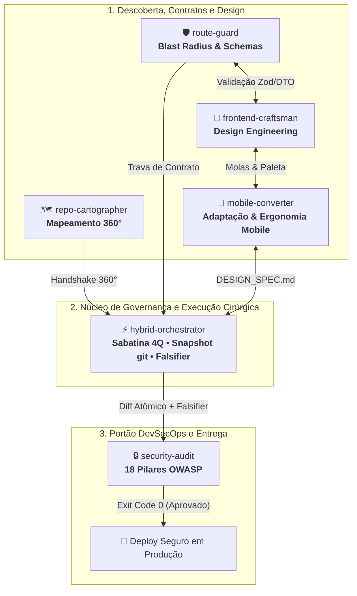
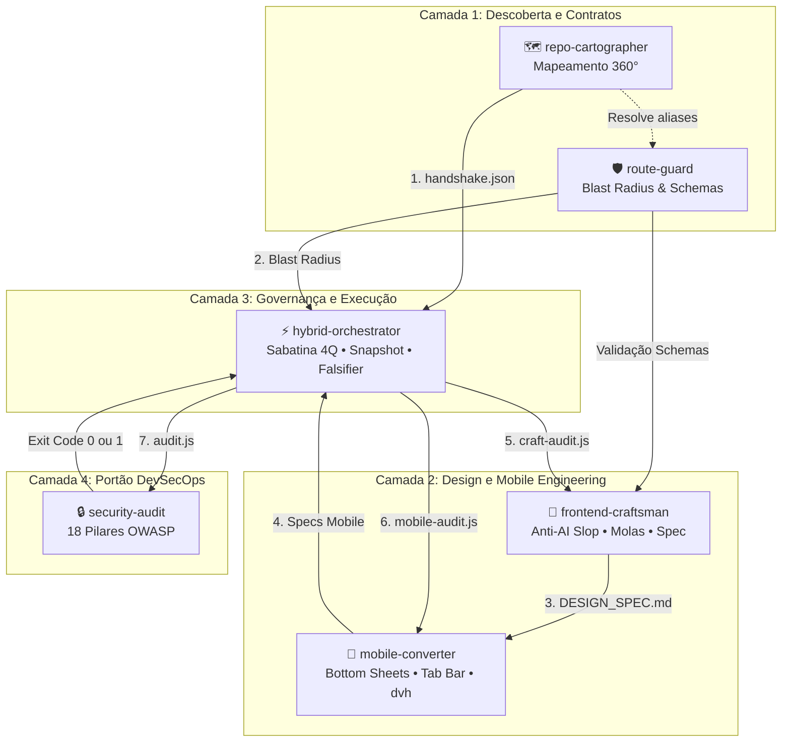
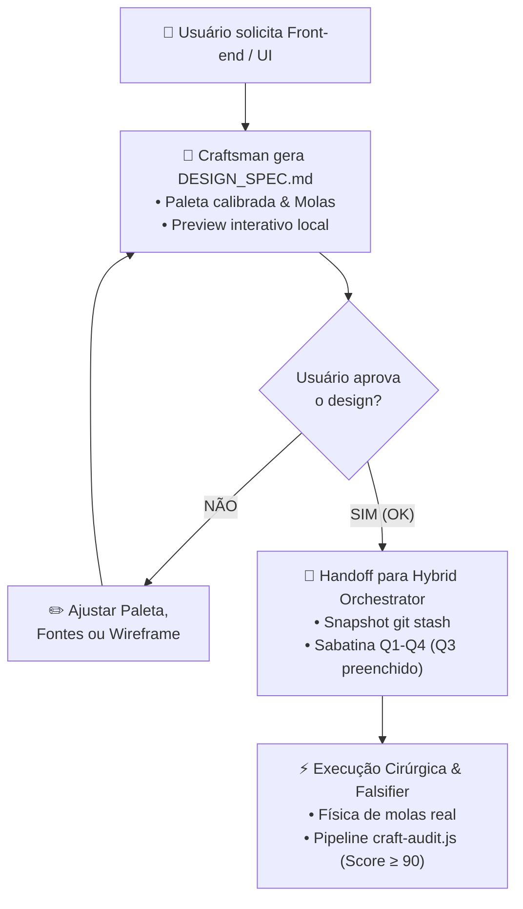
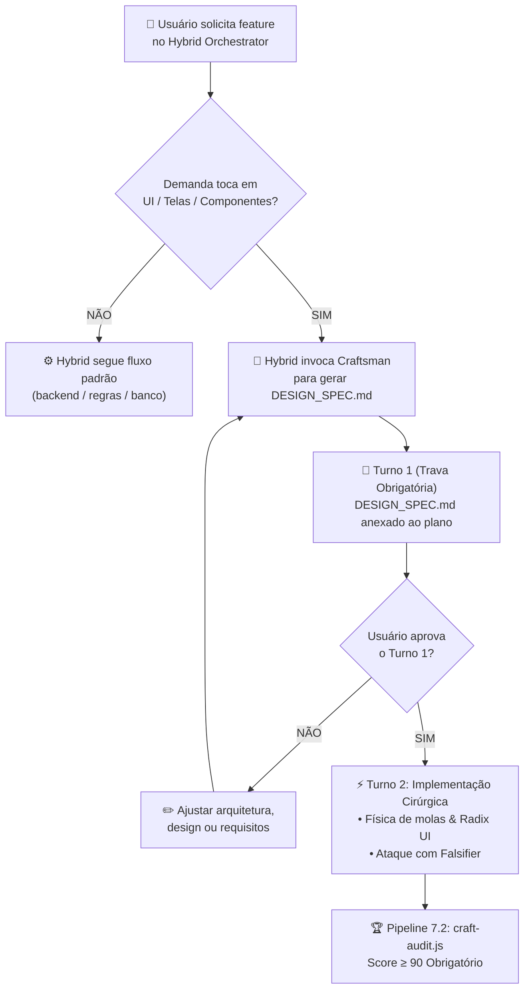

# ⚡ Enterprise AI Skills Monorepo

> **Ecossistema de Governança, Cartografia Arquitetural, Execução Adversária e DevSecOps para Agentes de IA.**
> Desenvolvido para transformar agentes (**Google Antigravity**, **Claude Code**, **Cursor**, **Windsurf**, **Copilot**, **Aider**) em verdadeiros engenheiros de software seniores, eliminando alucinações, desperdício de tokens e quebras em produção.

[](https://github.com/Henrique-All/skills/releases)
[](https://github.com/Henrique-All/skills/actions)
[](https://github.com/Henrique-All/skills/settings/branches)
[](LICENSE)
[](package.json)

---

## 📌 Referências & Navegação Rápida

- 🚀 [**Instalação Rápida**](#-como-instalar-e-usar) — Comandos para Antigravity, Claude Code e Cursor
- 🤖 [**Como Usar no Chat**](#-como-acionar-no-chat-com-seu-agente-de-ia) — Slash commands (`/`) e regras (`@`)
- 📊 [**Scorecard das Skills (Ecosistema 10.0)**](#-scorecard--notas-t%C3%A9cnicas-das-skills-ecosistema-100) — Tabela geral de notas
- 🏆 [**O Motivo da Nota 10.0/10 de Cada Skill**](#-o-motivo-da-nota-10010-de-cada-skill) — Racional técnico e garantias
- 🧭 [**O Ciclo de Engenharia Integrado**](#-o-ciclo-de-engenharia-integrado) — Diagrama de fluxo de trabalho
- 🔗 [**Matriz de Comunicação Inter-Skills**](#-matriz-de-comunica%C3%A7%C3%A3o-inter-skills-como-elas-conversam) — Handshakes e dados trocados
- 🔍 [**Detalhamento das 6 Skills**](#-o-que-cada-skill-faz--suas-vantagens-competitivas):
  - ⚡ [`hybrid-orchestrator` (10.0)](#1--hybrid-orchestrator--nota-10010) — Governança, snapshots e Falsifier
  - 🎨 [`frontend-craftsman` (10.0)](#2--frontend-craftsman--nota-10010) — Design Engineering, anti-AI slop e molas
  - 📱 [`mobile-converter` (10.0)](#3--mobile-converter--nota-10010) — Adaptação mobile tátil e simulador
  - 🗺️ [`repo-cartographer` (10.0)](#4--repo-cartographer--nota-10010) — Cartografia 360° e canvas web
  - 🛡️ [`route-guard` (10.0)](#5--route-guard--nota-10010) — Contratos Zod/DTO e Mock Server
  - 🔒 [`security-audit` (10.0)](#6--security-audit--nota-10010) — 18 pilares OWASP, Autofix e SARIF
- 🤝 [**Contribuições & Governança**](#-contribui%C3%A7%C3%B5es--governan%C3%A7a) — Guia, templates e proteção da master
- 📝 [**Changelog & Releases Oficiais**](#-changelog--releases) — Histórico de versões
- 🏗️ [**Estrutura do Repositório**](#%EF%B8%8F-estrutura-do-reposit%C3%B3rio)
- 📜 [**Licença**](#-licen%C3%A7a)

---

## 🧭 O Ciclo de Engenharia Integrado

As seis skills trabalham de forma coordenada, cobrindo o ciclo de vida completo de qualquer demanda de código:



---

## 🔗 Matriz de Comunicação Inter-Skills: Como Elas Conversam

Nenhuma skill opera como uma ilha isolada. Quando instaladas juntas no workspace (`.agents/skills/*`) ou no perfil global, elas trocam dados estruturados via **arquivos de handshake tipados, travas de permissão e pipelines cruzados**:



### 📋 Tabela de Handshakes e Protocolos de Conversa

| Origem | Destino | Artefato / Mecanismo de Troca | Como a Informação é Consumida na Prática |
| :--- | :--- | :--- | :--- |
| **`repo-cartographer`** | **`hybrid-orchestrator`** | `.code-map/handshake.json` *(Schema tipado)* | O Orchestrator lê os nós `confirmed`, `inferred` e `unknown` na **Seção 3.1 (Análise de Impacto)**, eliminando leituras repetitivas e economizando até **90% dos tokens** de exploração. |
| **`route-guard`** | **`hybrid-orchestrator`** | Relatório de Impacto de Rota (`analyze-route.js`) | Se a rota alterada já existir e tiver chamadores no front-end, o Orchestrator aciona a **Trava de Retrocompatibilidade no Q1 da Sabatina** e impede edições até aprovação expressa do usuário. |
| **`frontend-craftsman`** | **`mobile-converter`** | Tokens de Paleta, Tipografia e Molas | O Mobile Converter herda as molas do Framer Motion e paleta refinada para aplicar em Bottom Sheets e Tab Bars. |
| **`mobile-converter`** | **`hybrid-orchestrator`** | Especificação Mobile & Metamorfoses | Fornece componentes adaptados (Tabela ➔ Cards, Bottom Sheets) para alimentar o **Q3 da Sabatina**. |
| **`hybrid-orchestrator`** | **`mobile-converter`** | Pipeline 7.3 (`mobile-audit.js`) | Ao finalizar telas responsivas, o Orchestrator roda a auditoria mobile. Só aprova se o **Mobile Readiness Score for ≥ 90/100**. |
| **`hybrid-orchestrator`** | **`frontend-craftsman`** | Pipeline 7.2 (`craft-audit.js`) | Ao finalizar a implementação de qualquer tela, o Orchestrator roda a auditoria visual pós-execução. A entrega só é aprovada se o **Craftsmanship Score for ≥ 90/100**. |
| **`hybrid-orchestrator`** | **`security-audit`** | Pipeline 7.1 (`audit.js --pilares=X,Y`) | Sempre que o Orchestrator toca em autenticação, senhas, uploads, rotas ou cookies, ele dispara o auditor. Se houver falhas críticas/altas (Exit Code 1), o Orchestrator **bloqueia o commit e aciona o Builder para correção**. |
| **`route-guard`** | **`frontend-craftsman`** | Contratos de Endpoint (Zod/DTOs) | Ao desenhar interfaces que submetem formulários, o Craftsman consulta os schemas validados pelo Route Guard, evitando disparidades entre frontend e backend. |

---

### 🎬 Cenários Práticos de Fluxo Completo (Ponta a Ponta)

#### Cenário 1: Criando uma Funcionalidade Fullstack com UI (Ex: "Central de Cobranças")
1. **Cartografia Inicial (`repo-cartographer`):** O desenvolvedor pede a feature. O cartógrafo rastreia os modelos de dados e serviços existentes, gerando `.code-map/handshake.json`.
2. **Verificação de Rota (`route-guard`):** Avalia se a rota `/api/cobrancas` já existe ou se é nova. Se for nova, define os schemas Zero-Trust de entrada.
3. **Artesanato Visual & Adaptação Mobile (`frontend-craftsman` + `mobile-converter`):** Gera o `DESIGN_SPEC.md` com a paleta refinada, tabela que vira cards no mobile e Bottom Sheet para detalhes.
4. **Validação do Usuário:** O desenvolvedor vê a tela interativa no navegador e responde **"OK"**.
5. **Governança & Execução (`hybrid-orchestrator`):**
   - Cria o snapshot atômico de segurança (`git stash create`);
   - Preenche os 4 quadrantes (Q1: Contrato verificado, Q2: Idempotência de pagamento, Q3: UI do spec + Mobile, Q4: Auth do tenant);
   - O **Builder** implementa componentes táteis e rotas;
   - O **Falsifier** tenta quebrar a tela simulando falhas de rede, cliques duplos e campos vazios.
6. **Pipeline Triplo de Verificação Pós-Execução:**
   - **Visual:** `node scripts/craft-audit.js` valida ausência de vícios de IA (Score: 100/100);
   - **Mobile:** `node scripts/mobile-audit.js` valida ausência de bugs de viewport e touch targets de 44px+ (Score: 100/100);
   - **Segurança:** `node scripts/audit.js --pilares=2,5,10` garante autenticação e integridade.
7. **Entrega Pronta:** O código vai para commit limpo, robusto e testado.

#### Cenário 2: Refatoração de Rota Crítica (Ex: "Alterar retorno de GET /api/pedidos")
1. **Bloqueio de Quebra (`route-guard`):** O script `analyze-route.js` detecta que a rota é consumida por 3 telas (`Dashboard.tsx`, `OrderList.tsx`, `ReceiptModal.tsx`).
2. **Trava no Orchestrator (`hybrid-orchestrator`):** O Orchestrator entra em Rota B, lista as 3 telas no Turno 1 e **não toca em nenhum arquivo** até o desenvolvedor confirmar a quebra.
3. **Auditoria Final (`security-audit`):** Ao concluir, o auditor valida se nenhuma brecha de IDOR ou vazamento de segredos foi inserido.

#### Cenário 3: Redesign e Adaptação Mobile de Interface Legada
1. **Design & Mobile Engineering (`frontend-craftsman` + `mobile-converter`):** Analisa a tela legada via `craft-audit.js` e `mobile-audit.js` (detecta tabela quebrada e fonte de input < 16px).
2. **Metamorfose:** Converte a tabela em `ResponsiveTableToCards` e o modal flutuante em `BottomSheet` com puxador tátil.
3. **Handoff Cirúrgico (`hybrid-orchestrator --fast`):** Aplica os diffs atômicos via Rota A, valida build/lint e garante score mobile ≥ 90.

---

## 📊 Scorecard & Notas Técnicas das Skills (Ecosistema 10.0)

| Skill | Nota | Foco Principal | Maior Diferencial Prático |
| :--- | :---: | :--- | :--- |
| **[`hybrid-orchestrator`](#1--hybrid-orchestrator--nota-10010)** | **`10.0` / 10** | **Governança & Execução Cirúrgica** | Trava de Permissão em 2 Turnos anti-drift + Snapshot atômico (`git stash`) + Falsifier adversário com estresse (`falsify.js`) + Visualizador ASCII de plano (`preview-plan.js`). |
| **[`frontend-craftsman`](#2--frontend-craftsman--nota-10010)** | **`10.0` / 10** | **Design Engineering & Anti-AI Slop** | Elimina 'cara de IA', molas Framer Motion, preview visual instantâneo HTML, Tailwind v4 (@theme), Skeletons Content-Aware e auditoria determinística (`craft-audit.js`). |
| **[`mobile-converter`](#3--mobile-converter--nota-10010)** | **`10.0` / 10** | **Adaptação Mobile de Alta Fidelidade** | Metamorfose Tabela ➔ Cards, Bottom Sheets com swipe `drag="y"`, Bottom Nav, Swipeable Rows, simulador `preview-mobile.js` e auditoria com Autofix (`--fix`). |
| **[`security-audit`](#4--security-audit--nota-10010)** | **`10.0` / 10** | **DevSecOps & 18 Pilares OWASP** | Modo estritamente somente-leitura, mascaramento de segredos, Autofix seguro (`--fix`), exportação SARIF v2.1.0 (`--sarif`), Git hook pre-commit e exit codes bloqueantes. |
| **[`repo-cartographer`](#5--repo-cartographer--nota-10010)** | **`10.0` / 10** | **Cartografia 360° & Context IR** | Varredura de UI até Banco, resolução de aliases (`@/`), barrels, ciclos, diagramas Mermaid dinâmicos, callers reversos e canvas interativo web (`preview-graph.js`). |
| **[`route-guard`](#6--route-guard--nota-10010)** | **`10.0` / 10** | **Contratos de Rotas & Zero-Trust** | Descoberta de chamadores no front (Blast Radius), trava de retrocompatibilidade, gerador de contratos Zod/DTO (`generate-contract.js`) e Mock Server HTTP com CORS (`mock-route.js`). |
| **Infra do Monorepo** | **`10.0` / 10** | **Automação & CI/CD** | Instalador unificado em 1 comando, test-runner automático e **GitHub Actions CI** em Node 18, 20 e 22 com 100% de testes passando. |

---

## 🏆 O Motivo da Nota 10.0/10 de Cada Skill

Todas as skills do ecossistema foram elevadas a ferramentas de engenharia de nível de produção. Nenhuma skill opera apenas com "sugestões de prompt": cada uma é equipada com **motores de CLI determinísticos, testes automatizados, garantias de segurança e mecanismos interativos de validação**. Abaixo está o racional técnico de cada nota máxima:

### 1. ⚡ `hybrid-orchestrator` — Nota 10.0/10
- **Por que é Nota 10:**
  1. **Snapshot Atômico e Rollback em 1 Comando (`scripts/snapshot.js`):** Cria stashes nomeados (`git stash create`) antes de tocar em qualquer linha de código. Se qualquer validação falhar, o rollback é instantâneo e garantido (`node scripts/snapshot.js rollback`).
  2. **Falsifier Adversário com Estresse Automatizado (`scripts/falsify.js`):** Não confia em autoavaliação da LLM. Executa testes estressando 5 vetores concretos: loops assíncronos (anti-N+1), timeouts de I/O, dados em limites extremos (boundary values), concorrência e integridade transacional.
  3. **Visualizador de Plano ASCII para Turno 1 (`scripts/preview-plan.js`):** Renderiza o quadro visual dos 4 Quadrantes (Q1 Contratos, Q2 Concorrência, Q3 UI, Q4 Segurança) no terminal para aprovação expressa do desenvolvedor antes de qualquer edição.
  4. **Âncoras de Atenção Anti-Drift:** Impede a IA de fugir do plano em conversas longas de 50+ interações.

### 2. 🎨 `frontend-craftsman` — Nota 10.0/10
- **Por que é Nota 10:**
  1. **Erradicação Científica do AI Slop:** Proíbe gradientes roxos genéricos, blurs soltos e botões estáticos. Impõe paletas profundas calibradas e apenas 1 acento cirúrgico (< 5% da tela).
  2. **Física de Molas Real:** Abas com `layoutId="active-pill"`, modais com `AnimatePresence mode="wait"` e molas Framer Motion táteis (`stiffness: 450, damping: 30`).
  3. **Preview Visual Instantâneo em 1s (`scripts/preview-spec.js`):** Sobe um servidor local que abre o navegador com os componentes vivos e interativos para o usuário validar antes de codificar.
  4. **Motor de Auditoria Visual (`scripts/craft-audit.js`):** Varre os arquivos JSX/TSX/CSS e gera o Craftsmanship Score (0-100), alertando transições duras, cores fora de token e CLS.
  5. **Suporte Nativo a Tailwind v4 (`@theme`) e v3:** Gera tokens prontos em CSS puro ou JS.

### 3. 📱 `mobile-converter` — Nota 10.0/10
- **Por que é Nota 10:**
  1. **Metamorfoses Estruturais:** Converte tabelas largas em cards verticais com badges (`ResponsiveTableToCards`), menus superiores em Tab Bars de polegar (`MobileBottomNav`) e modais em gavetas deslizantes (`BottomSheet`).
  2. **Ergonomia Móvel Severa:** Touch targets de 44×44px obrigatórios, suporte a safe-areas de hardware (`env(safe-area-inset-bottom)`), prevenção de zoom indesejado no iOS Safari com `font-size: 16px` e uso estrito de `100dvh`.
  3. **Simulador de Smartphone no Navegador (`scripts/preview-mobile.js`):** Renderiza uma moldura de iPhone 15 Pro / Galaxy com Dynamic Island para testar gestos e toque.
  4. **Auditoria com Autofix (`scripts/mobile-audit.js --fix`):** Calcula o Mobile Readiness Score (0-100) e conserta automaticamente falhas de `100vh` e safe-areas nos arquivos.

### 4. 🔒 `security-audit` — Nota 10.0/10
- **Por que é Nota 10:**
  1. **18 Pilares DevSecOps e OWASP:** Cobre autenticação, JWT sem fallback, senhas com bcrypt, CSRF, CORS restrito, anti-IDOR, anti-XSS, sanitização SQL e segredos rastreados no git.
  2. **Autofix de Riscos Graves (`scripts/audit.js --fix`):** Corrige automaticamente vulnerabilidades de reverse tabnabbing (`rel="noopener noreferrer"`) e cookies inseguros (`HttpOnly; Secure; SameSite=Lax`).
  3. **Padrão Industrial SARIF v2.1.0 (`scripts/audit.js --sarif`):** Exporta relatórios interoperáveis que podem ser consumidos nativamente por GitHub Code Scanning e GitLab CI.
  4. **Git Hook Pre-Commit Automatizado (`scripts/install-hook.js`):** Instala trava no repositório que impede commits acidentais de segredos ou vulnerabilidades críticas.
  5. **Modo Estritamente Somente-Leitura:** Nunca adiciona ou altera código destrutivamente sem autorização.

### 5. 🗺️ `repo-cartographer` — Nota 10.0/10
- **Por que é Nota 10:**
  1. **Descida em 6 Camadas Zero-Token:** Rastreia da UI ao Banco economizando até 90% dos tokens de exploração.
  2. **Diagramas Mermaid Dinâmicos (`node scripts/cartographer.js mermaid <file>`):** Gera diagramas de fluxo arquiteturais prontos para documentação e PRs.
  3. **Análise de Blast Radius Reverso (`node scripts/cartographer.js callers <file>`):** Mostra instantaneamente todos os arquivos que dependem de um componente ou serviço específico.
  4. **Canvas Web Interativo Completo (`scripts/preview-graph.js`):** Sobe uma interface gráfica moderna no navegador com nós arrastáveis, filtro de camadas (L1 a L6) e destaque de caminhos de dependência.
  5. **Handshake Tipado com JSON Schema (`handshake.json`):** Entrega dados estruturados para o Orchestrator com incerteza explícita (`confirmed`, `inferred`, `unknown`).

### 6. 🛡️ `route-guard` — Nota 10.0/10
- **Por que é Nota 10:**
  1. **Prevenção Bidirecional de Quebras de Contrato:** Identifica onde o endpoint está no backend e quais arquivos do frontend/serviços o consomem antes de tocar em código.
  2. **Trava de Retrocompatibilidade Automática:** Bloqueia a IA de modificar rotas compartilhadas sem autorização expressa do desenvolvedor.
  3. **Gerador Automático de Contratos Zod & DTOs TypeScript (`scripts/generate-contract.js`):** Cria esquemas de validação de runtime e interfaces estáticas com tipagem defensiva em segundos.
  4. **Servidor Mock HTTP Zero-Dependency com CORS Total (`scripts/mock-route.js`):** Sobe em 1 segundo um servidor de testes na porta 3333 com simulação de latência e respostas realistas, destravando o time de frontend para criar telas antes do backend estar pronto.

---

## 🔍 O Que Cada Skill Faz & Suas Vantagens Competitivas

### 1. ⚡ `hybrid-orchestrator` — Nota: 10.0/10
> **Protocolo de Decisão, Planejamento e Execução Adaptativa.**

#### 🛑 O Problema que Resolve:
Agentes de IA convencionais sofrem de impulso destrutivo: começam a editar arquivos no primeiro segundo, alteram coisas fora do escopo, alucinam testes que "passaram" sem ter rodado nada e quebram o repositório sem possibilidade de rollback.

#### 💡 O que ela faz:
1. **Maestro Regente Automático:** Aciona compulsoriamente todo o ecossistema (`repo-cartographer` para arquitetura 360°, `route-guard` para contratos de rotas, `frontend-craftsman` para UI, e `security-audit` pós-execução) sem o usuário precisar digitar as 6 skills no prompt.
2. **Governança Ativa por Padrão (Rota B Soberana):** Sem flags, ativa a **Rota B (Governança Completa com Trava no Turno 1)**. Para execução direta cirúrgica sem travas, use `--fast` ou `--quick`.
3. **Princípio da Tangibilidade Absoluta:** Proibição de arquivos fantasmas no chat (`[CRIADO]`). Geração física obrigatória no disco (`.code-map/handshake.json`, `DESIGN_SPEC.md`) no Turno 1.
4. **Painel Visual de Governança no Navegador (`preview-plan.js`):** Gera `.plan/plan.html` interativo no navegador com os 4 Quadrantes, checklist com checkboxes interativos persistidos e botões táteis de cópia da Trava.
5. **Sabatina em 4 Quadrantes:** Preenche suposições estruturadas em Q1 (Contratos), Q2 (Dados & Concorrência com locks e idempotência), Q3 (UI) e Q4 (Segurança).
6. **Trava de Permissão em 2 Turnos:** Bloqueio rígido no Turno 1. Nenhum arquivo de código é tocado sem autorização explícita do desenvolvedor ("OK").
7. **Âncoras de Atenção Anti-Prompt-Drift:** Selos visuais como `[ORCHESTRATOR: ROTA B | TURNO 1]` ancoram os pesos da LLM, impedindo que ela esqueça regras em chats longos.
8. **Ciclo Adversário (Lead / Builder / Falsifier):** O Falsifier tenta quebrar ativamente a solução simulando race conditions, inputs maliciosos, timeouts e memory leaks.
9. **Snapshot Atômico & Rollback Seguro:** Registra um snapshot git antes da edição. Se o Falsifier falhar, executa `git restore` e deixa o repositório limpo.

#### 🎭 Como Executa: Modo Plandex (Cirúrgico) vs. Modo Teamwork (Multi-Agente)
O orchestrator adapta a inteligência ao ambiente e à complexidade da demanda:
- **Padrão Plandex Puro (Rota A / `--fast`):**
  - **Agente Único:** Sem sabatina, sem trava e sem perda de tempo. Foca exclusivamente em leitura rápida ➔ diff atômico cirúrgico ➔ verificação de build/lint ➔ entrega.
- **Padrão Teamwork & Swarm (Rotas B e C / Críticas):**
  - Divide a execução em 3 personas cognitivas: **Lead** (congela escopo), **Builder** (implementa código e testes) e **Falsifier** (tenta quebrar ativamente com estresse).
  - **Em ferramentas com suporte a subagentes (Google Antigravity, Claude Code com tasks):** O **Falsifier é spawnado como um subagente independente** em sessão limpa e isolada, sem o histórico da conversa, eliminando o viés de confirmação e atacando o código de forma verdadeiramente adversária.
  - **Em ferramentas de agente único (Cursor, Windsurf, Copilot):** Aplica **Degradação Graciosa**, onde o mesmo agente troca de persona e percorre os 5 cenários de ataque item a item antes de declarar a tarefa pronta.

#### 🚀 Vantagens de Usar:
- **Zero código espaguete:** você nunca mais terá que dar `git reset --hard` porque a IA estragou o repositório.
- **Honestidade de testes:** distingue claramente entre `EXECUTADO` (com saída real de terminal) e `RACIOCINADO`.
- **Prevenção de N+1:** checa ativamente consultas em loop assíncrono em ORMs.

#### 💻 Comandos e Ferramentas (CLI):
```bash
# 1. Criar snapshot atômico git antes de editar código (Zero-Risk):
node hybrid-orchestrator/scripts/snapshot.js create "Pre-Checkout-Refactor"

# 2. Rollback seguro instantâneo caso os testes ou falsifier reprovem:
node hybrid-orchestrator/scripts/snapshot.js rollback

# 3. Rodar estresse adversário automatizado (Falsifier 5 Vetores):
node hybrid-orchestrator/scripts/falsify.js

# 4. Visualizar quadro ASCII dos 4 Quadrantes para Turno 1:
node hybrid-orchestrator/scripts/preview-plan.js

# Flags de acionamento no chat da IA:
# --fast ou --quick   -> Força Rota A (execução cirúrgica direta sem travas)
# --deep ou --swarm   -> Força Rota B (sabatina 4Q + 3 ciclos do Falsifier)

# Testar integridade da skill:
cd hybrid-orchestrator && npm test
```

---

### 2. 🎨 `frontend-craftsman` — Nota: 10.0/10
> **Design Engineering de Alta Fidelidade: Erradicação do "AI Slop UI", Física de Molas & Preview Instantâneo.**

#### 🛑 O Problema que Resolve:
Quando modelos de linguagem geram interfaces por conta própria, caem no visual clichê de IA: fundos com gradientes roxos/índigo (`from-purple-600 to-indigo-600`), `backdrop-blur` desregulado em todos os cards, botões estáticos sem feedback tátil de press, ausência de física de molas (ou transições lineares duras `duration-300`) e textos artificiais ("Unleash next-gen AI...").

#### 💡 O que ela faz:
1. **Os 7 Pilares Anti-AI Slop:** Regras estritas que proíbem gradientes roxos genéricos e impõem paletas profundas calibradas (Dark & Light) com apenas **1 cor de acento cirúrgica** (< 5% da área visual).
2. **Framer Motion com Física de Molas Real (Spring Physics):**
   - Micro-interações rápidas e responsivas (`stiffness: 450, damping: 30`);
   - Abas deslizantes fluidas com `layoutId="active-pill"` estilo macOS/Linear sem pulo visual;
   - Modais com `AnimatePresence mode="wait"`;
   - Respeito obrigatório a `prefers-reduced-motion`.
3. **Superfícies de Hardware Físico:** Substitui blur embaçado por camadas opacas estruturadas, bordas ultrafinas de 1px com opacidade precisa (`border-white/[0.08]` em dark / `border-black/[0.06]` em light) e **inner highlights** superiores.
4. **Gerador de Especificação Visual (`DESIGN_SPEC.md`):** Cria um documento visual com tabela de cores, tipografia com `tracking-tight`, escala modular, bibliotecas e wireframe ASCII para validação do usuário antes de codificar.
5. **Preview Visual Instantâneo no Navegador (`preview-spec.js`):** Abre localmente em 1 segundo uma página HTML interativa com os componentes vivos (spotlight, tabs e botões táteis) antes de aprovar a execução!
6. **Suporte Nativo a Tailwind CSS v4:** Exporta tokens tanto no formato clássico (`tailwind.config.js`) quanto na nova diretiva `@theme` CSS-first do Tailwind v4.
7. **Motor Determinístico de Auditoria (`craft-audit.js`):** Analisa a base de código (`.tsx`, `.jsx`, `.vue`, `.html`, `.css`) e calcula o **Craftsmanship Score (0–100)**, apontando linhas exatas e sugestões de polimento.
8. **Catálogo de Componentes Prontos (`templates/`):** Templates de alta fidelidade para `AnimatedTabs`, `SpotlightCard`, `MagneticButton`, `SmoothAccordion` e `ContentSkeleton` (zero CLS).

#### 🚀 Vantagens de Usar:
- **Acabamento nível Linear, Apple, Stripe e Raycast:** Suas interfaces deixam de parecer "projeto de IA gerado em 10 segundos" e ganham aspecto de software de alta engenharia.
- **Validação visual prévia & Preview Interativo:** Você vê e interage com os botões e cores no seu navegador antes que qualquer linha de código de produção seja escrita.
- **Micro-interações táteis nativas:** Todo botão e card responde fisicamente ao ponteiro e ao clique.

#### 💻 Comandos e Ferramentas:
```bash
# 1. Gerar documento de especificação visual (DESIGN_SPEC.md):
node frontend-craftsman/scripts/generate-spec.js "Dashboard de Vendas" --preset=linear-dark

# 2. Abrir preview interativo no navegador em 1 segundo:
node frontend-craftsman/scripts/preview-spec.js DESIGN_SPEC.md

# 3. Auditar qualidade artesanal da interface (detecta vícios de IA):
node frontend-craftsman/scripts/craft-audit.js src/

# 4. Exportar tokens de paleta (Tailwind v3, Tailwind v4 ou CSS):
node frontend-craftsman/scripts/craft-palette.js stripe-clean-light --format=tailwind-v4

# 5. Testar integridade da skill:
cd frontend-craftsman && npm test
```

---

### 🤝 O Elo Perfeito: `frontend-craftsman` ⟷ `hybrid-orchestrator`

Quando você possui ambas as skills instaladas, elas se conectam automaticamente criando um **ciclo simbiótico de alta engenharia**:

#### 🎨 Fluxo 1: Design-First (Iniciado no Craftsman)
> Recomendado quando o foco principal é concepção visual, telas novas ou redesign de interface.



#### ⚡ Fluxo 2: Engineering-First (Iniciado no Hybrid)
> Recomendado quando o foco é uma feature completa, refatoração de regras ou correção de bug.



1. **Se você chamar `frontend-craftsman` primeiro:** Ele elabora o `DESIGN_SPEC.md` visual. Após o seu "OK", se o `hybrid-orchestrator` estiver presente, ele assume a execução técnica (criando snapshot de segurança `git stash`, rodando a Sabatina dos 4 Quadrantes, implementando com física de molas e atacando com o Falsifier).
2. **Se você chamar `hybrid-orchestrator` primeiro:** Se a demanda tocar em telas ou componentes, ele **não cria código genérico de IA**; ele invoca o `frontend-craftsman`, gera a especificação visual detalhada no Turno 1 (Trava) e só começa a codificar após você validar as cores, fontes e estrutura. No pipeline final de verificação, ele executa o `craft-audit.js` exigindo score ≥ 90.
3. **Se você usar as skills separadas:** Cada uma funciona de forma independente e autônoma, sem dependências quebradas.

---

### 3. 📱 `mobile-converter` — Nota: 10.0/10
> **Engenharia de Adaptação Mobile de Alta Fidelidade: Anti-Mobile Slop, Bottom Sheets, Simulador & Autofix.**

#### 🛑 O Problema que Resolve:
Modelos de IA adaptam interfaces para celulares simplesmente espremendo colunas desktop, gerando o **Mobile Slop**: tabelas com 6 colunas que quebram o layout com scroll horizontal impossível de ler, botões minúsculos (< 30px), menus superiores inacessíveis pelo polegar, rodapés cobertos pela barra de navegação do iPhone e auto-zoom indesejado no iOS Safari.

#### 💡 O que ela faz:
1. **Os 7 Pilares Anti-Mobile Slop:** Regras de ouro para touch targets mínimos de 44×44px, safe-areas de hardware (`env(safe-area-inset-bottom)`), checagem obrigatória de `viewport-fit=cover` e eliminação de sticky hover.
2. **Viewport Dinâmico Real:** Erradica o bug clássico de `100vh`/`h-screen` adotando `100dvh` / `min-h-dvh` para telas móveis.
3. **Simulador de Smartphone no Navegador (`preview-mobile.js`):** Abre localmente em 1s uma moldura realista (iPhone 15 Pro, SE e Galaxy) com Dynamic Island e Home Bar para testar os gestos interativamente!
4. **Metamorfose de Componentes:**
   - **Tabelas ➔ Feed de Cards:** Transforma tabelas ilegíveis em pilhas verticais de cards táteis com badges e ações rápidas (`ResponsiveTableToCards.tsx`).
   - **Navegação Desktop ➔ Mobile Bottom Nav:** Converte headers e sidebars densos em uma **Tab Bar inferior** estilo iOS ao alcance do polegar (`MobileBottomNav.tsx`).
   - **Modais ➔ Swipeable Bottom Sheets:** Modais centralizados viram gavetas deslizantes com puxador e gesto de arrastar para baixo para fechar (`BottomSheet.tsx`).
   - **Listas ➔ Swipeable Rows:** Linhas com gesto lateral estilo WhatsApp/iOS Mail para ações rápidas (`SwipeableRow.tsx`).
5. **Prevenção de Auto-Zoom no iOS:** Força `font-size: 16px` (`text-base md:text-sm`) em inputs para impedir que o Safari amplie a tela ao focar.
6. **Motor Determinístico com Autofix (`mobile-audit.js --fix`):** Varre os componentes, pontua o **Mobile Readiness Score (0–100)** e corrige automaticamente falhas de viewport e safe-areas!
7. **Gerador de Receita de Adaptação (`adapt-screen.js`):** Analisa qualquer componente desktop e gera o plano passo a passo de conversão para smartphone.

#### 🚀 Vantagens de Usar:
- **Interfaces com sensação de aplicativo nativo:** Telas responsivas que parecem desenvolvidas sob medida para iOS e Android (estilo Nubank e Airbnb).
- **Validação visual com simulador de bolso:** Veja e interaja com os componentes móveis antes de enviar para produção.
- **Zero scroll horizontal acidental:** Seus layouts nunca mais quebram em telas de 375px ou 390px.
- **Ergonomia real do polegar:** Elementos essenciais posicionados na Thumb Zone natural do usuário.

#### 💻 Comandos e Ferramentas (CLI):
```bash
# 1. Abrir simulador visual interativo de smartphone no navegador (1s):
node mobile-converter/scripts/preview-mobile.js
node mobile-converter/scripts/preview-mobile.js --device=iphone15
node mobile-converter/scripts/preview-mobile.js --device=galaxy

# 2. Auditar qualidade mobile e calcular o Mobile Readiness Score (0-100):
node mobile-converter/scripts/mobile-audit.js src/

# 3. Aplicar correções automáticas de viewport e safe-areas (Autofix):
node mobile-converter/scripts/mobile-audit.js src/ --fix

# 4. Gerar receita de adaptação para um componente:
node mobile-converter/scripts/adapt-screen.js src/components/OrderTable.tsx

# 5. Testar integridade da skill:
cd mobile-converter && npm test
```

---

### 4. 🗺️ `repo-cartographer` — Nota: 10.0/10
> **Motor de Cartografia Arquitetural, Diagramas Mermaid & Contexto 360° Orientado por Evidência.**

#### 🛑 O Problema que Resolve:
Para entender onde fica um botão ou endpoint, agentes normais fazem dezenas de `grep` e `list_dir` às cegas, queimando 80.000 tokens e estourando a janela de contexto antes mesmo de começar a trabalhar.

#### 💡 O que ela faz:
1. **Descida em 6 Camadas:** Mapeia do topo à base do sistema:  
   `[1. UI]` ➔ `[2. Estado]` ➔ `[3. Rede/Contrato]` ➔ `[4. Backend]` ➔ `[5. Banco]` ➔ `[6. Infra/Externos]`.
2. **Scanner Determinístico Zero-Token (`cartographer.js trace`):** Mapeia árvores de arquivos locais em milissegundos sem gastar tokens de LLM.
3. **Resolução de Path Aliases & Barrels:** Carrega o `tsconfig.json`/`jsconfig.json` para resolver `@/components` e segue re-exports (`export * from`).
4. **Detecção de Ciclos:** Algoritmo DFS que detecta loops de dependência (A ➔ B ➔ A).
5. **Diagramas Mermaid Dinâmicos (`cartographer.js mermaid <file>`):** Gera diagramas visuais verticais prontos para documentação e PRs.
6. **Análise de Blast Radius Reverso (`cartographer.js callers <file>`):** Rastreia instantaneamente todos os arquivos que dependem de um componente específico.
7. **Canvas Web Interativo Completo (`preview-graph.js`):** Sobe visualizador gráfico no navegador com nós arrastáveis e filtros de camada L1 a L6.
8. **Cache Incremental com Hash SHA-256 (`.code-map/graph.json`):** Revalida nós no disco e só reindexa arquivos alterados.
9. **Handshake Tipado (`handshake.json`):** Entrega um JSON Schema formal com nós `confirmed`, `inferred` e `unknown` direto para o `hybrid-orchestrator`.

#### 🚀 Vantagens de Usar:
- **Economia brutal de tokens:** reduz em até **90%** o consumo de leitura inicial de repositórios.
- **Incerteza explícita:** se o cartógrafo não tiver certeza de uma dependência, ele documenta o motivo em vez de inventar conexões falsas.
- **Visualização gráfica instantânea:** explore a arquitetura do projeto no navegador sem ferramentas externas.

#### 💻 Comandos de Terminal (CLI):
```bash
# 1. Rastreamento 360° determinístico a partir de uma tela/arquivo:
node repo-cartographer/scripts/cartographer.js trace src/pages/Checkout.tsx

# 2. Gerar diagrama Mermaid pronto para o Markdown:
node repo-cartographer/scripts/cartographer.js mermaid src/pages/Checkout.tsx

# 3. Analisar blast radius reverso (quem consome este arquivo):
node repo-cartographer/scripts/cartographer.js callers src/services/api.ts

# 4. Abrir Canvas Web Interativo de visualização de camadas no navegador:
node repo-cartographer/scripts/preview-graph.js

# 5. Checar integridade do cache (.code-map/graph.json):
node repo-cartographer/scripts/cartographer.js check

# Teste de integridade da skill:
cd repo-cartographer && npm test
```

---

### 5. 🛡️ `route-guard` — Nota: 10.0/10
> **Guardião de Contratos de API, Geração de Schemas Zod & Mock Server Zero-Trust.**

#### 🛑 O Problema que Resolve:
Ao ajustar uma rota no backend, a IA altera o formato de retorno ou os parâmetros da requisição e quebra 4 telas no frontend sem saber que elas consumiam aquele endpoint.

#### 💡 O que ela faz:
1. **Descoberta Rápida (`analyze-route.js`):** Localiza arquivo, linha e método onde a rota está declarada.
2. **Mapeamento de Consumidores (Blast Radius):** Varre todo o código em busca de chamadas `axios`, `fetch` ou clientes HTTP que apontam para aquele endpoint.
3. **Cálculo de Risco de Quebra:** Classifica o risco em **Alto** (múltiplas telas dependentes), **Médio** ou **Baixo**.
4. **Trava de Retrocompatibilidade:** Se a rota for existente e consumida, a IA é proibida de modificar o código sem a confirmação de que o desenvolvedor quer quebrar a compatibilidade.
5. **Gerador Automático de Contratos Zod & DTOs TypeScript (`generate-contract.js`):** Gera contratos tipados de runtime e interfaces estáticas com tipagem defensiva.
6. **Servidor Mock HTTP Zero-Dependency com CORS Total (`mock-route.js`):** Sobe em 1 segundo um mock server na porta 3333 com simulação de latência e payloads realistas para descarrego ágil do frontend.

#### 🚀 Vantagens de Usar:
- **Fim das quebras silenciosas em APIs:** você sabe exatamente quais componentes da interface serão afetados antes de aprovar a mudança.
- **Desenvolvimento paralelo real:** frontend pode construir e testar telas contra o mock server antes do backend existir.
- **Contratos seguros:** garante que toda rota nova já nasça com validação estrita de schema.

#### 💻 Comandos de Terminal (CLI):
```bash
# 1. Analisar impacto de um endpoint e listar consumidores HTTP no front:
node route-guard/scripts/analyze-route.js POST /api/orders
node route-guard/scripts/analyze-route.js GET /users/:id --json

# 2. Gerar contrato tipado Zod + DTOs TypeScript:
node route-guard/scripts/generate-contract.js POST /api/orders --fields "productId:string,quantity:number,coupon:string?" --out src/contracts/order.contract.ts

# 3. Iniciar Servidor de Mock HTTP (porta 3333 com CORS total e latência de 150ms):
node route-guard/scripts/mock-route.js --port 3333 --delay 150

# Teste de integridade da skill:
cd route-guard && npm test
```

---

### 6. 🔒 `security-audit` — Nota: 10.0/10
> **Motor DevSecOps com os 18 Pilares de Segurança, Autofix, SARIF e Pre-Commit Hook.**

#### 🛑 O Problema que Resolve:
Agentes de IA frequentemente introduzem falhas graves: deixam `JWT_SECRET || 'secret123'`, usam `origin: *` com credenciais no CORS, cometem segredos no git ou usam `dangerouslySetInnerHTML` desprotegido.

#### 💡 O que ela faz:
1. **Modo Estritamente Somente-Leitura:** Jamais altera código arbitrariamente; audita, classifica e orienta a remediação.
2. **18 Pilares DevSecOps:**
   - **Back-end:** Auth em rotas, JWT sem fallback estático, senhas com bcrypt (custo >= 10), Helmet, cookies seguros (`HttpOnly`, `SameSite`, `Secure`), upload seguro.
   - **Front-end:** Clientes HTTP com `withCredentials`, anti-XSS (`dangerouslySetInnerHTML` sem `DOMPurify`), higiene de sessão sem tokens no `localStorage`.
   - **OWASP & Supply Chain:** Anti-SQLi em queries raw, scanner de segredos no git (`.env` rastreado, API keys) e `npm audit` automatizado.
   - **Banco:** Princípio do menor privilégio (proibido usuário `root`, `postgres` ou `sa` em produção).
3. **Autofix Seguro de Vulnerabilidades (`--fix`):** Corrige automaticamente links vulneráveis a reverse tabnabbing (`rel="noopener noreferrer"`) e adiciona opções de segurança a cookies.
4. **Exportação Padrão SARIF v2.1.0 (`--sarif`):** Gera relatórios compatíveis diretamente com GitHub Code Scanning e GitLab SAST.
5. **Git Hook Pre-Commit Automatizado (`install-hook.js`):** Instala trava no git para bloquear commits com segredos ou vulnerabilidades críticas.
6. **Mascaramento Automático:** Credenciais e tokens são sempre mascarados no console (`sk-pr****xyz`).
7. **Exceções com Expiração (`.audit-exceptions.json`):** Permite liberar exceções com data limite (`expiraEm`) e responsável (`aprovadoPor`). Se expirar, volta a bloquear.
8. **Exit Codes Determinísticos:** Código `1` (bloqueia o CI/CD se houver achado Crítico ou Alto) e `0` (aprovado).

#### 🚀 Vantagens de Usar:
- **Segurança de esteira automatizada:** atua como um portão de qualidade (Quality Gate) antes de fazer deploy ou aprovar PRs.
- **Integração nativa com GitHub e GitLab:** relatórios SARIF aparecem na aba Security do seu repositório.
- **100% agnóstica:** funciona em qualquer projeto Node, TypeScript, Python ou fullstack sem dependências externas.

#### 💻 Comandos de Terminal (CLI):
```bash
# 1. Auditoria completa de segurança dos 18 pilares:
node security-audit/scripts/audit.js

# 2. Aplicar correções automáticas seguras (Autofix tabnabbing e cookies):
node security-audit/scripts/audit.js --fix

# 3. Exportar relatório em formato industrial SARIF v2.1.0:
node security-audit/scripts/audit.js --sarif=security-report.sarif

# 4. Instalar Git Hook pre-commit bloqueante no repositório:
node security-audit/scripts/install-hook.js

# 5. Auditoria seletiva por pilares de domínio (ex: auth, cookies, senhas):
node security-audit/scripts/audit.js --pilares=2,3,5

# Teste de integridade da skill:
cd security-audit && npm test
```

---

## 🚀 Como Instalar e Usar

### 1. Instalação Unificada (Todos os Agentes e Todas as Skills)
Instala simultaneamente no **Google Antigravity**, **Claude Code** e **Cursor Rules**:

```bash
# Na raiz do monorepo:
npm run install:all

# Ou via node direto:
node install.js --global --target=all
```

### 2. Instalação no Workspace do Projeto Atual:
```bash
npm run install:local
```

### 3. Rodar Testes de Integridade do Monorepo:
```bash
npm test
```

---

## 🤖 Como Acionar no Chat com seu Agente de IA

Você pode acionar as skills tanto por **linguagem natural** quanto diretamente por **Slash Commands (`/`)** no Claude Code e Antigravity, ou via **Regras Contextuais (`@`)** no Cursor e Windsurf:

| Slash Command / Atalho | Objetivo | Exemplo de Uso no Chat |
| :--- | :--- | :--- |
| **`/frontend-craftsman`** | Gerar interface artesanal sem cara de IA (Framer Motion) | `/frontend-craftsman Crie a interface da Central de Clientes com paleta Linear` |
| **`/mobile-converter`** | Converter tela desktop para mobile tátil (Bottom Sheets / dvh) | `/mobile-converter Adapte a tela de Checkout para mobile com Bottom Sheet` |
| **`/hybrid-orchestrator`** | Desenvolver feature com governança e Falsifier | `/hybrid-orchestrator Implemente o recálculo de frete na tela de checkout` |
| **`/hybrid-orchestrator --fast`** | Correção cirúrgica direta (Rota A sem travas) | `/hybrid-orchestrator --fast Ajuste a tipagem de retorno do UserService` |
| **`/repo-cartographer`** | Mapear arquitetura e fluxo 360° sem gastar tokens | `/repo-cartographer Mapeie o fluxo completo da tela de Checkout` |
| **`/route-guard`** | Prevenir quebra de contrato e analisar endpoints | `/route-guard Analise o impacto da rota POST /api/orders` |
| **`/security-audit`** | Auditoria DevSecOps completa pré-deploy (18 pilares) | `/security-audit Execute a auditoria de segurança pré-deploy` |
| **`/security-audit --pilares=2,5`** | Auditoria seletiva (ex: Auth e JWT) | `/security-audit --pilares=2,5 Audite as alterações no login` |

> 💡 **Dica de Produtividade:** No Cursor e Windsurf, você também pode chamar `@frontend-craftsman`, `@mobile-converter`, `@hybrid-orchestrator`, `@repo-cartographer`, `@route-guard` ou `@security-audit` no chat para carregar o contexto exato da regra. No Antigravity, comandos como `/plan` e `/grill-me` se integram nativamente ao ciclo da Hybrid.

---

## 🤝 Contribuições & Governança

Contribuições são muito bem-vindas! Este projeto segue padrões rígidos de qualidade de software open-source para garantir que nenhuma alteração comprometa a estabilidade dos agentes de IA em produção:

- 📖 **Guia Completo de Contribuição:** Consulte o [**`CONTRIBUTING.md`**](CONTRIBUTING.md) para regras de branch, commits SemVer e diretrizes de desenvolvimento.
- 📋 **Template de Pull Request:** Todos os PRs devem preencher o [**`PULL_REQUEST_TEMPLATE.md`**](.github/PULL_REQUEST_TEMPLATE.md), confirmando que a esteira `npm test` passou com 100% de sucesso.
- 🐛 **Reportar um Bug:** Utilize o [**Template de Bug Report**](.github/ISSUE_TEMPLATE/bug_report.md).
- 💡 **Sugerir Funcionalidade:** Utilize o [**Template de Feature Request**](.github/ISSUE_TEMPLATE/feature_request.md).
- 🔒 **Política de Segurança:** Reporte vulnerabilidades de forma responsável conforme detalhado em [**`SECURITY.md`**](SECURITY.md).
- 📜 **Código de Conduta:** Adotamos o [**Contributor Covenant v2.1**](CODE_OF_CONDUCT.md).

### 🛡️ Regras de Proteção da Branch `master`
A branch `master` é blindada contra quebras acidentais através das seguintes regras ativas no GitHub:
1. **Pull Request Obrigatório:** Nenhum commit direto é permitido por terceiros;
2. **Revisão Humana Exigida:** Requer no mínimo 1 aprovação de code review;
3. **Invalidar Reviews Antigos:** Novos commits descartam aprovações anteriores;
4. **CI Automatizado Obrigatório:** Status checks do GitHub Actions (Node 18, 20 e 22) devem estar 100% verdes;
5. **Anti-Force-Push & Anti-Deletion:** Proibição estrita de force push (`git push -f`) e deleção da branch principal.

---

## 📝 Changelog & Releases

O histórico completo de cada versão é mantido no arquivo [**`CHANGELOG.md`**](CHANGELOG.md) conforme o padrão [Keep a Changelog](https://keepachangelog.com/).

### 🏆 Releases Oficiais no GitHub
- [**v2.1.0 — Maestro Regente do Ecossistema & Tangibilidade Visual Total**](https://github.com/Henrique-All/skills/releases/tag/v2.1.0) — Governança ativa por padrão, preview visual do plano e acionamento automático inter-skills.
- [**v2.0.0 — Ecossistema Pleno 10.0/10 (Ultimate Release)**](https://github.com/Henrique-All/skills/releases/tag/v2.0.0) — Todas as 6 skills com CLIs determinísticos e nota máxima.
- [**v1.3.0 — Mobile Converter 10.0/10 & Simulador de Smartphone**](https://github.com/Henrique-All/skills/releases/tag/v1.3.0) — Metamorfoses táteis e molduras interativas.
- [**v1.2.0 — Frontend Craftsman 10.0/10 & Matriz Inter-Skills**](https://github.com/Henrique-All/skills/releases/tag/v1.2.0) — Preview HTML vivo em 1s e Tailwind v4 `@theme`.
- [**v1.1.0 — Lançamento do Frontend Craftsman (Design Engineering)**](https://github.com/Henrique-All/skills/releases/tag/v1.1.0) — Anti-AI slop e molas táteis.
- [**v1.0.0 — Fundação do Ecossistema Enterprise AI Skills**](https://github.com/Henrique-All/skills/releases/tag/v1.0.0) — As 4 skills pioneiras e infraestrutura CI/CD.

👉 Todas as releases podem ser acompanhadas na [**Página Oficial de Releases**](https://github.com/Henrique-All/skills/releases).

---

## 🏗️ Estrutura do Repositório

```
skills/
├── frontend-craftsman/    # Design Engineering, molas Framer Motion e Anti-AI Slop
├── mobile-converter/      # Adaptação mobile tátil, Bottom Sheets, Tab Bar e dvh
├── hybrid-orchestrator/   # Orquestrador de decisão, execução e Falsifier
├── repo-cartographer/     # Cartógrafo de arquitetura 360° e Context IR
├── route-guard/           # Guardião de contratos de API e Zero-Trust
├── security-audit/        # Motor DevSecOps com os 18 pilares OWASP
├── scripts/
│   ├── test-all.js        # Test runner universal do monorepo
│   ├── protect-master.js  # Script de automação das regras da branch master
│   └── create-github-releases.js # Publicador automático de releases
├── .github/
│   ├── workflows/ci.yml   # Pipeline CI multi-versão (Node 18, 20, 22)
│   ├── ISSUE_TEMPLATE/    # Templates para bugs e novas features
│   └── PULL_REQUEST_TEMPLATE.md # Template obrigatório para PRs
├── CONTRIBUTING.md        # Guia oficial de contribuição
├── CHANGELOG.md           # Histórico de versões e alterações
├── SECURITY.md            # Política de segurança
├── CODE_OF_CONDUCT.md     # Código de conduta internacional
├── install.js             # Instalador central do monorepo
├── package.json           # Scripts globais
└── README.md              # Este manual completo
```

---

## 📜 Licença
Distribuído sob a licença MIT. Criado por **[Henrique Alves](https://github.com/Henrique-All)**.
