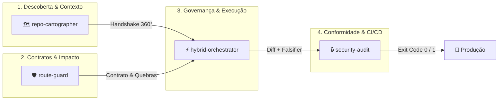

# ⚡ Enterprise AI Skills Monorepo

> **Ecossistema de Governança, Cartografia Arquitetural, Execução Adversária e DevSecOps para Agentes de IA.**
> Desenvolvido para transformar agentes (**Google Antigravity**, **Claude Code**, **Cursor**, **Windsurf**, **Copilot**, **Aider**) em verdadeiros engenheiros de software seniores, eliminando alucinações, desperdício de tokens e quebras em produção.

---

## 🧭 O Ciclo de Engenharia Integrado

As quatro skills trabalham de forma coordenada, cobrindo o ciclo de vida completo de qualquer demanda de código:



---

## 📊 Scorecard & Notas Técnicas das Skills

| Skill | Nota | Foco Principal | Maior Diferencial Prático |
| :--- | :---: | :--- | :--- |
| **[`hybrid-orchestrator`](#1--hybrid-orchestrator--nota-9810)** | **`9.8` / 10** | **Governança & Execução Cirúrgica** | Trava de Permissão em 2 Turnos anti-drift + Snapshot atômico (`git stash`) + Falsifier adversário com estresse. |
| **[`security-audit`](#2--security-audit--nota-9710)** | **`9.7` / 10** | **DevSecOps & 18 Pilares OWASP** | Modo estritamente somente-leitura, mascaramento de segredos, exit codes bloqueantes para CI e suporte a `.audit-exceptions.json`. |
| **[`repo-cartographer`](#3--repo-cartographer--nota-9610)** | **`9.6` / 10** | **Cartografia 360° & Context IR** | Varredura de UI até Banco, resolução de aliases (`@/`), barrels recursivos, detecção de ciclos e Handshake tipado em JSON Schema. |
| **[`route-guard`](#4--route-guard--nota-9610)** | **`9.6` / 10** | **Contratos de Rotas & Zero-Trust** | Descoberta de chamadores no frontend/serviços, trava de retrocompatibilidade para endpoints existentes e validação estrita de schemas. |
| **Infra do Monorepo** | **`10.0` / 10** | **Automação & CI/CD** | Instalador unificado em 1 comando, test-runner automático e **GitHub Actions CI** em Node 18, 20 e 22. |

---

## 🔍 O Que Cada Skill Faz & Suas Vantagens Competitivas

### 1. ⚡ `hybrid-orchestrator` — Nota: 9.8/10
> **Protocolo de Decisão, Planejamento e Execução Adaptativa.**

#### 🛑 O Problema que Resolve:
Agentes de IA convencionais sofrem de impulso destrutivo: começam a editar arquivos no primeiro segundo, alteram coisas fora do escopo, alucinam testes que "passaram" sem ter rodado nada e quebram o repositório sem possibilidade de rollback.

#### 💡 O que ela faz:
1. **Classificação Tripla:** Separa automaticamente em **Rota A** (cirúrgica, ≤3 arquivos), **Rota C** (híbrida, 2–3 arquivos interdependentes) ou **Rota B** (adversária, crítica/complexa).
2. **Sabatina em 4 Quadrantes:** Preenche suposições estruturadas em Q1 (Contratos), Q2 (Dados & Concorrência com locks e idempotência), Q3 (UI) e Q4 (Segurança).
3. **Trava de Permissão em 2 Turnos:** Nenhum arquivo é tocado sem autorização explícita do desenvolvedor.
4. **Âncoras de Atenção Anti-Prompt-Drift:** Selos visuais como `[ORCHESTRATOR: ROTA B | TURNO 1]` ancoram os pesos da LLM, impedindo que ela esqueça regras em chats com 50+ mensagens.
5. **Ciclo Adversário (Lead / Builder / Falsifier):** O Falsifier tenta quebrar ativamente a solução simulando race conditions, inputs maliciosos, timeouts e memory leaks.
6. **Snapshot Atômico & Rollback Seguro:** Registra um snapshot git antes da edição. Se o Falsifier falhar, executa `git restore` e deixa o repositório limpo.

#### 🎭 Como Executa: Modo Plandex (Cirúrgico) vs. Modo Teamwork (Multi-Agente)
O orchestrator adapta a inteligência ao ambiente e à complexidade da demanda:
- **Padrão Plandex Puro (Rota A / `--fast`):**
  - **Agente Único:** Sem sabatina, sem trava e sem perda de tempo. Foca exclusivamente em leitura rápida ➔ diff atômico cirúrgico ➔ verificação de build/lint ➔ entrega.
- **Padrão Teamwork & Swarm (Rotas B e C / Críticas):**
  - Divide a execução em 3 personas cognitivas: **Lead** (congela escopo), **Builder** (implementa código e testes) e **Falsifier** (tenta quebrar ativamente com estresse).
  - **Em ferramentas com suporte a subagentes (Google Antigravity, Claude Code com tasks):** O **Falsifier é spawnado como um subagente independente** em sessão limpa e isolada, sem o histórico da conversa, eliminando o viés de confirmação e atacando o código de forma verdadeiramente adversária.
  - **Em ferramentas de agente único (Cursor, Windsurf, Copilot):** Aplica **Degradação Graciosa**, onde o mesmo agente troca de persona e percorre os 5 cenários de ataque item a item antes de declarar a tarefa pronta.

#### 🚀 Vantagens de Usar:
- **Zero código espaguete:** você nunca mais terá que dar `git reset --hard` porque a IA estragou o repositório.
- **Honestidade de testes:** distingue claramente entre `EXECUTADO` (com saída real de terminal) e `RACIOCINADO`.
- **Prevenção de N+1:** checa ativamente consultas em loop assíncrono em ORMs.

#### 💻 Comandos e Flags:
```bash
# Flags de acionamento no prompt do chat:
# --fast ou --quick   -> Força Rota A (execução cirúrgica sem travas)
# --deep ou --swarm   -> Força Rota B (sabatina completa + 3 iterações de Falsifier)

# Testar integridade da skill:
cd hybrid-orchestrator && npm test

# Instalação isolada:
node hybrid-orchestrator/install.js --global --target=all
```

---

### 2. 🗺️ `repo-cartographer` — Nota: 9.6/10
> **Motor de Cartografia Arquitetural e Contexto 360° Orientado por Evidência.**

#### 🛑 O Problema que Resolve:
Para entender onde fica um botão ou endpoint, agentes normais fazem dezenas de `grep` e `list_dir` às cegas, queimando 80.000 tokens e estourando a janela de contexto antes mesmo de começar a trabalhar.

#### 💡 O que ela faz:
1. **Descida em 6 Camadas:** Mapeia do topo à base do sistema:  
   `[1. UI]` ➔ `[2. Estado]` ➔ `[3. Rede/Contrato]` ➔ `[4. Backend]` ➔ `[5. Banco]` ➔ `[6. Infra/Externos]`.
2. **Scanner Determinístico Zero-Token (`cartographer.js trace`):** Mapeia árvores de arquivos locais em milissegundos sem gastar tokens de LLM.
3. **Resolução de Path Aliases & Barrels:** Carrega o `tsconfig.json`/`jsconfig.json` para resolver `@/components` e segue re-exports (`export * from`).
4. **Detecção de Ciclos:** Algoritmo DFS que detecta loops de dependência (A ➔ B ➔ A).
5. **Cache Incremental com Hash SHA-256 (`.code-map/graph.json`):** Revalida nós no disco e só reindexa arquivos alterados.
6. **Canvas Interativo para Obsidian:** Exporta o mapa arquitetural completo em formato `.canvas` visual e notas markdown com `[[wikilinks]]`.
7. **Handshake Tipado (`handshake.json`):** Entrega um JSON Schema formal com nós `confirmed`, `inferred` e `unknown` direto para o `hybrid-orchestrator`.

#### 🚀 Vantagens de Usar:
- **Economia brutal de tokens:** reduz em até **90%** o consumo de leitura inicial de repositórios.
- **Incerteza explícita:** se o cartógrafo não tiver certeza de uma dependência, ele documenta o motivo em vez de inventar conexões falsas.

#### 💻 Comandos de Terminal (CLI):
```bash
# Rastreamento 360° determinístico a partir de uma tela/arquivo:
node repo-cartographer/scripts/cartographer.js trace src/pages/Checkout.tsx

# Checar se o cache (.code-map/graph.json) continua sincronizado com o disco:
node repo-cartographer/scripts/cartographer.js check

# Exportar grafo para o Obsidian (.canvas interativo e notas com [[wikilinks]]):
node repo-cartographer/scripts/cartographer.js obsidian

# Inicializar a pasta .code-map/ em um projeto novo:
node repo-cartographer/scripts/cartographer.js init
```

---

### 3. 🛡️ `route-guard` — Nota: 9.6/10
> **Guardião de Contratos de API, Blast Radius e Zero-Trust.**

#### 🛑 O Problema que Resolve:
Ao ajustar uma rota no backend, a IA altera o formato de retorno ou os parâmetros da requisição e quebra 4 telas no frontend sem saber que elas consumiam aquele endpoint.

#### 💡 O que ela faz:
1. **Descoberta Rápida (`analyze-route.js`):** Localiza arquivo, linha e método onde a rota está declarada.
2. **Mapeamento de Consumidores (Blast Radius):** Varre todo o código em busca de chamadas `axios`, `fetch` ou clientes HTTP que apontam para aquele endpoint.
3. **Cálculo de Risco de Quebra:** Classifica o risco em **Alto** (múltiplas telas dependentes), **Médio** ou **Baixo**.
4. **Trava de Retrocompatibilidade:** Se a rota for existente e consumida, a IA é proibida de modificar o código sem a confirmação de que o desenvolvedor quer quebrar a compatibilidade.
5. **Políticas Zero-Trust:** Assegura validação de entrada (Zod/DTOs), isolamento de tenant (anti-IDOR) e middleware de autenticação.

#### 🚀 Vantagens de Usar:
- **Fim das quebras silenciosas em APIs:** você sabe exatamente quais componentes da interface serão afetados antes de aprovar a mudança.
- **Contratos seguros:** garante que toda nova rota já nasça com validação estrita de schema.

#### 💻 Comandos de Terminal (CLI):
```bash
# Analisar impacto de um endpoint e listar consumidores HTTP no front:
node route-guard/scripts/analyze-route.js POST /api/orders
node route-guard/scripts/analyze-route.js GET /users/:id

# Saída em JSON estruturado (ideal para automações de CI):
node route-guard/scripts/analyze-route.js POST /auth/login --json

# Teste de integridade da skill:
cd route-guard && npm test
```

---

### 4. 🔒 `security-audit` — Nota: 9.7/10
> **Motor DevSecOps com os 18 Pilares de Segurança e Conformidade OWASP.**

#### 🛑 O Problema que Resolve:
Agentes de IA frequentemente introduzem falhas graves: deixam `JWT_SECRET || 'secret123'`, usam `origin: *` com credenciais no CORS, cometem segredos no git ou usam `dangerouslySetInnerHTML` desprotegido.

#### 💡 O que ela faz:
1. **Modo Estritamente Somente-Leitura:** Jamais altera código arbitrariamente; audita, classifica e orienta a remediação.
2. **18 Pilares DevSecOps:**
   - **Back-end:** Auth em rotas, JWT sem fallback estático, senhas com bcrypt (custo >= 10), Helmet, cookies seguros (`HttpOnly`, `SameSite`, `Secure`), upload seguro.
   - **Front-end:** Clientes HTTP com `withCredentials`, anti-XSS (`dangerouslySetInnerHTML` sem `DOMPurify`), higiene de sessão sem tokens no `localStorage`.
   - **OWASP & Supply Chain:** Anti-SQLi em queries raw, scanner de segredos no git (`.env` rastreado, API keys) e `npm audit` automatizado.
   - **Banco:** Princípio do menor privilégio (proibido usuário `root`, `postgres` ou `sa` em produção).
3. **Mascaramento Automático:** Credenciais e tokens são sempre mascarados no console (`sk-pr****xyz`).
4. **Exceções com Expiração (`.audit-exceptions.json`):** Permite liberar exceções com data limite (`expiraEm`) e responsável (`aprovadoPor`). Se expirar, volta a bloquear.
5. **Exit Codes Determinísticos:** Código `1` (bloqueia o CI/CD se houver achado Crítico ou Alto) e `0` (aprovado).

#### 🚀 Vantagens de Usar:
- **Segurança de esteira automatizada:** atua como um portão de qualidade (Quality Gate) antes de fazer deploy ou aprovar PRs.
- **100% agnóstica:** funciona em qualquer projeto Node, TypeScript, Python ou fullstack sem dependências externas.

#### 💻 Comandos de Terminal (CLI):
```bash
# Auditoria completa de segurança dos 18 pilares:
node security-audit/scripts/audit.js

# Auditoria seletiva por pilares de domínio (ex: auth, cookies, senhas):
node security-audit/scripts/audit.js --pilares=2,3,5

# Exportar relatório estruturado em JSON:
node security-audit/scripts/audit.js --json

# Teste de integridade da skill:
cd security-audit && npm test
```

---

## 🚀 Como Instalar e Usar

### 1. Instalação Unificada (Todos os Agentes e Todas as Skills)
Instala simultaneamente no **Google Antigravity**, **Claude Code** e **Cursor Rules**:

```bash
# Na raiz do monorepo:
npm run install:all

# Ou via node direto:
node install.js --global --target=all
```

### 2. Instalação no Workspace do Projeto Atual:
```bash
npm run install:local
```

### 3. Rodar Testes de Integridade do Monorepo:
```bash
npm test
```

---

## 🤖 Como Acionar no Chat com seu Agente de IA

Você pode acionar as skills tanto por **linguagem natural** quanto diretamente por **Slash Commands (`/`)** no Claude Code e Antigravity, ou via **Regras Contextuais (`@`)** no Cursor e Windsurf:

| Slash Command / Atalho | Objetivo | Exemplo de Uso no Chat |
| :--- | :--- | :--- |
| **`/hybrid-orchestrator`** | Desenvolver feature com governança e Falsifier | `/hybrid-orchestrator Implemente o recálculo de frete na tela de checkout` |
| **`/hybrid-orchestrator --fast`** | Correção cirúrgica direta (Rota A sem travas) | `/hybrid-orchestrator --fast Ajuste a tipagem de retorno do UserService` |
| **`/repo-cartographer`** | Mapear arquitetura e fluxo 360° sem gastar tokens | `/repo-cartographer Mapeie o fluxo completo da tela de Checkout` |
| **`/route-guard`** | Prevenir quebra de contrato e analisar endpoints | `/route-guard Analise o impacto da rota POST /api/orders` |
| **`/security-audit`** | Auditoria DevSecOps completa pré-deploy (18 pilares) | `/security-audit Execute a auditoria de segurança pré-deploy` |
| **`/security-audit --pilares=2,5`** | Auditoria seletiva (ex: Auth e JWT) | `/security-audit --pilares=2,5 Audite as alterações no login` |

> 💡 **Dica de Produtividade:** No Cursor e Windsurf, você também pode chamar `@hybrid-orchestrator`, `@repo-cartographer`, `@route-guard` ou `@security-audit` no chat para carregar o contexto exato da regra. No Antigravity, comandos como `/plan` e `/grill-me` se integram nativamente ao ciclo da Hybrid.

---

## 🏗️ Estrutura do Repositório

```
skills/
├── hybrid-orchestrator/   # Orquestrador de decisão, execução e Falsifier
├── repo-cartographer/     # Cartógrafo de arquitetura 360° e Context IR
├── route-guard/           # Guardião de contratos de API e Zero-Trust
├── security-audit/        # Motor DevSecOps com os 18 pilares OWASP
├── scripts/
│   └── test-all.js        # Test runner universal do monorepo
├── .github/
│   └── workflows/ci.yml   # Pipeline CI multi-versão (Node 18, 20, 22)
├── install.js             # Instalador central do monorepo
├── package.json           # Scripts globais
└── README.md              # Este manual completo
```

---

## 📜 Licença
Distribuído sob a licença MIT. Criado por **[Henrique Alves](https://github.com/Henrique-All)**.
