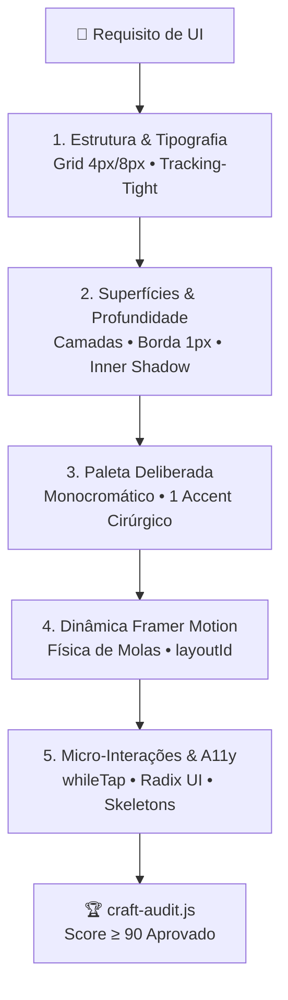
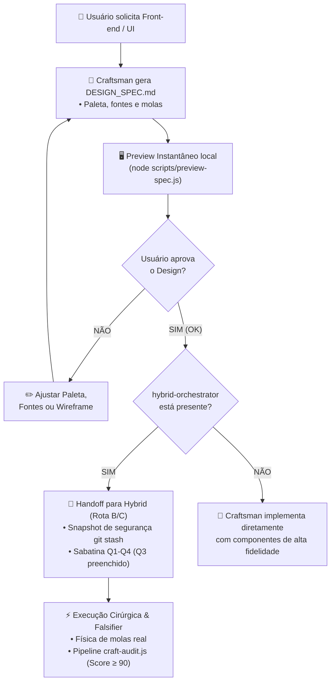
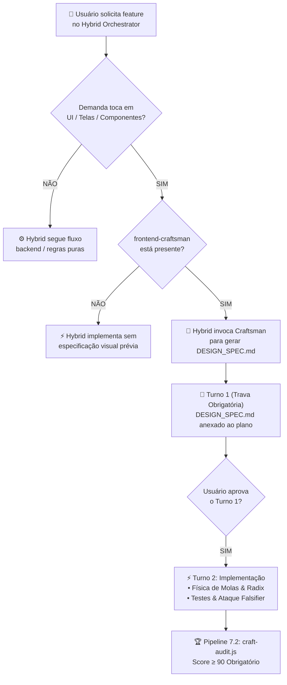

# 🎨 Frontend Craftsman — Protocolo de Engenharia de Interface Artesanal

O **Frontend Craftsman** é o protocolo de engenharia de design (*Design Engineering*) projetado para erradicar o **"AI Slop UI"** (interfaces com cara de template gerado por IA). Ele estabelece regras rígidas para criar aplicações web que pareçam construídas manualmente por equipes de elite de design de produto (como **Linear, Apple, Stripe, Raycast e Vercel**).

---

## 🛑 O Diagnóstico: O Que é a "Cara de IA" (*AI Slop UI*)?

Quando IAs geram código de front-end sem diretrizes de artesanato, elas caem invariavelmente nos mesmos 7 vícios:

| Vício da IA Genérica | O Que a IA Faz | Padrão Frontend Craftsman |
| :--- | :--- | :--- |
| **1. Síndrome do Roxo Neon** | `from-purple-600 to-indigo-600` em tudo (botões, títulos, bordas). | Paleta monocromática profunda (Zinc/Slate) com **1 única cor de destaque** cirúrgica (< 5% da área visual). |
| **2. Glassmorphism Sem Critério** | `backdrop-blur-md bg-white/5 border border-white/10 rounded-2xl` em todos os cards sem hierarquia. | Superfícies opacas em camadas (`elevation-1`, `elevation-2`), bordas ultrafinas de 1px com opacidade precisa e **inner-highlights** simulando chanfro de hardware real. |
| **3. Animações Duras / Ausentes** | `transition-all duration-300` linear ou ausência de micro-interações. | **Framer Motion com física de molas (Spring Physics)** realistas, `layoutId` para transições fluidas e respeito a `prefers-reduced-motion`. |
| **4. Layout de Hero Clichê** | Título centralizado "Transform your workflow with Next-Gen AI", 2 botões idênticos e 3 cards flutuantes. | Layouts assimétricos, Bento Grids estruturados, tipografia com `tracking-tight` e dashboards interativos reais em vez de ilustrações genéricas. |
| **5. Ausência de Feedback Tátil** | Botões sem estado de press (`:active` ou `whileTap`), sem anel de foco acessível. | Compressão tátil expressiva (`whileTap={{ scale: 0.98 }}`), efeitos de cursor magnético ou iluminação reativa (*Spotlight Cards*). |
| **6. Componentes Frágeis na Mão** | Modais e dropdowns feitos com `useState(isOpen)` que quebram acessibilidade, foco e tecla ESC. | Primitivos acessíveis baseados em **Radix UI / Headless UI**, com foco gerenciado, WAI-ARIA e retenção de foco. |
| **7. Estados de Espera Preguiçosos** | Spinner giratório solitário ou texto "Carregando...". | **Content-Aware Skeletons** que espelham exatamente a anatomia da interface final e evitam Layout Shift (CLS). |

---

## 🎯 Quando Acionar Esta Skill

Ative o protocolo sempre que:
1. For criar **novas telas, componentes ou páginas** de frontend (React, Next.js, Vue, Svelte, HTML/CSS).
2. O usuário pedir para a interface ficar **"mais profissional"**, **"com cara de produto real"**, **"estilo Linear/Stripe/Apple"** ou **"sem cara de IA"**.
3. For implementar **animações, transições de abas, modais, gavetas (drawers) ou micro-interações**.
4. For refatorar um frontend existente que está visualmente poluído ou com baixa qualidade de acabamento.
5. Antes de entregar código de UI para o usuário final.

---

## 📐 Os 5 Pilares de Execução do Craftsman



---

## ⚡ 1. Guia de Molas do Framer Motion (Spring Physics)

**NUNCA** use transições lineares ou `ease-in-out` em botões e micro-interações. Use molas calibradas:

### Presets Oficiais de Mola:

```typescript
// Configurações de Mola Padronizadas
export const SPRINGS = {
  // Micro-interações táteis: cliques em botões, toggles, badges
  snappy: { type: 'spring', stiffness: 450, damping: 30, mass: 0.8 },

  // Elementos estruturais: modais, drawers, popovers, dropdowns
  gentle: { type: 'spring', stiffness: 300, damping: 28 },

  // Transições de layout compartilhado: abas deslizantes, cards expansíveis
  layout: { type: 'spring', stiffness: 350, damping: 32 },

  // Movimentos orgânicos longos: notificações flutuantes, toasts
  float: { type: 'spring', stiffness: 200, damping: 22 },
};
```

### Regras de Ouro de Animação:
1. **Tabs e Pílulas de Seleção:** Use sempre `layoutId="active-pill"` dentro de um elemento filho `motion.div` com `position: absolute`. Isso garante o deslizamento contínuo estilo macOS.
2. **Saída de Elementos:** Todo modal, tooltip ou notificação condicional deve estar encapsulado em `<AnimatePresence mode="wait">` ou `popLayout`.
3. **Respeito à Acessibilidade:** Sempre consulte `useReducedMotion()`. Se ativado, substitua movimento de translação (`x`, `y`) por transição instantânea de opacidade (`opacity: 1`).

---

## 💎 2. Superfícies, Iluminação e Profundidade (Adeus ao Blur Poluído)

Para dar acabamento de hardware físico (estilo Apple e Linear):

### Anatomia de um Card de Alta Fidelidade (Tailwind):

```tsx
<motion.div
  whileHover={{ y: -2 }}
  transition={SPRINGS.snappy}
  className="
    relative rounded-xl p-5
    bg-zinc-900/80 
    border border-white/[0.08]
    shadow-[inset_0_1px_0_0_rgba(255,255,255,0.06)]
    hover:border-white/[0.16] hover:shadow-[0_8px_20px_-4px_rgba(0,0,0,0.5),inset_0_1px_0_0_rgba(255,255,255,0.1)]
    transition-colors duration-200
  "
>
  {/* Conteúdo */}
</motion.div>
```

- **`border-white/[0.08]`**: Borda cirúrgica de 1px com 8% de opacidade (evita bordas cinzas grossas).
- **`shadow-[inset_0_1px_0_0_rgba(255,255,255,0.06)]`**: O "inner highlight" superior que simula luz incidindo no chanfro superior da placa.
- **Fundo**: `#09090b` ou `zinc-900/80` em vez de preto puro `#000000` (que destrói o contraste de sombras).

---

## 🎨 3. Paletas de Cores de Elite (Regra 60-30-10)

1. **60% (Canvas Base):**
   - **Dark Mode:** Zinc escuro (`bg-[#09090b]`) ou Obsidian (`bg-[#0a0a0c]`). Nunca use preto puro `#000000` (que quebra sombras de elevação).
   - **Light Mode:** Canvas cerâmico/off-white (`bg-[#f8fafc]` ou `bg-[#f5f5f7]`). Evite branco puro no canvas para permitir destaque aos cards.
2. **30% (Superfícies & Estrutura):** Tons neutros com passos graduais (`zinc-900`, `zinc-800`, bordas `white/[0.08]` em dark; `bg-white`, bordas `black/[0.06]` em light).
3. **10% (Tipografia & Alto Contraste):** Títulos em `text-zinc-100` (dark) ou `text-slate-900` (light), textos de apoio em `text-zinc-400` / `text-slate-600`.
4. **< 5% (Cor de Acento - Escolha APENAS UMA):**
   - **Amber Linear:** `amber-500` / `amber-400`
   - **Emerald FinTech:** `emerald-500` / `emerald-400`
   - **Electric Cobalt:** `blue-500` / `blue-400`
   - **Crimson Pro:** `rose-500` / `rose-400`
   - **Stripe Royal Blue (Light):** `#0048e5` (contraste perfeito sobre branco)
   - **Apple Pure Blue (Light):** `#0071e3`

> ⚠️ **PROIBIDO:** Usar gradientes arco-íris ou combinar roxo com rosa neon sem justificativa formal de marca.

---

## 🤝 O Elo Simbiótico: Frontend Craftsman ⟷ Hybrid Orchestrator

Quando ambas as skills estão presentes no repositório ou no perfil global do usuário (`hybrid-orchestrator` + `frontend-craftsman`), elas estabelecem um **elo simbiótico automático**:

### 🎨 Fluxo 1: Design-First (Iniciado no Craftsman)
> Quando o desenvolvedor ou usuário solicita uma alteração visual, nova tela ou refinamento estético:



### ⚡ Fluxo 2: Engineering-First (Iniciado no Hybrid)
> Quando a solicitação começa pela orquestração técnica, bug ou feature de ponta a ponta:



### Regras do Acordo Simbiótico:
1. **Detecção Silenciosa & Sem Atrito:**
   - O agente verifica se `hybrid-orchestrator` existe em `.agents/skills/hybrid-orchestrator` ou no catálogo global (`~/.gemini/config/skills/`, `~/.claude/skills/`).
   - Se existir, **NUNCA** comece a codificar interfaces sem antes apresentar o `DESIGN_SPEC.md` visual.
2. **O Documento `DESIGN_SPEC.md`:**
   - Cria o arquivo na raiz do projeto contendo paleta (hex, contrastes, 1 accent), fontes, bibliotecas (`framer-motion`, `radix-ui`), física de molas e wireframe ASCII.
   - Oferece ou abre o preview interativo local com `node scripts/preview-spec.js`.
   - Pede a validação visual do usuário.
3. **Pós-Execução Blindada:**
   - Ao final da implementação técnica conduzida pelo `hybrid-orchestrator`, ele executa obrigatoriamente:
     ```bash
     node scripts/craft-audit.js [pasta-do-frontend]
     ```
     A aprovação final só é dada se o score for **>= 90/100**.

---

## 🛠️ Ferramentas da Skill

### 1. Preview Visual Instantâneo (`preview-spec.js`)
Gera e abre no navegador uma página HTML interativa com os botões táteis, cards com spotlight e a paleta real:
```bash
node scripts/preview-spec.js DESIGN_SPEC.md
```

### 2. Gerador de Especificação Visual (`generate-spec.js`)
Gera o `DESIGN_SPEC.md` formatado pronto para apresentar ao usuário:
```bash
node scripts/generate-spec.js "Nome da Tela / Módulo" --preset=linear-dark
```
*Presets disponíveis:* `linear-dark`, `supabase-emerald`, `raycast-obsidian`, `apple-neutral`, `stripe-clean-light`, `apple-pure-light`.

### 3. Auditoria de Artesanato Visual (`craft-audit.js`)
Analisa os arquivos do frontend e aponta os vícios de IA:
```bash
node scripts/craft-audit.js src/
```
*Gera o Craftsmanship Score (0-100) com lista de linhas a corrigir.*

### 4. Gerador de Tokens de Paleta (`craft-palette.js`)
Exporta tokens refinados para Tailwind CSS v3, Tailwind CSS v4 (`@theme`) ou CSS Modules:
```bash
# Tailwind v3
node scripts/craft-palette.js linear-dark

# Tailwind v4 (@theme CSS-First)
node scripts/craft-palette.js stripe-clean-light --format=tailwind-v4

# CSS Custom Properties (:root)
node scripts/craft-palette.js supabase-emerald --format=css
```

### 5. Catálogo de Componentes Artesanais (`templates/`)
A skill inclui templates prontos para copiar e colar:
- `AnimatedTabs.tsx`: Navegação com pílula deslizante `layoutId`.
- `SpotlightCard.tsx`: Card escuro com iluminação radial sensível ao ponteiro.
- `MagneticButton.tsx`: Botão com atração elástica e clique tátil.
- `SmoothAccordion.tsx`: Sanfona sem saltos de altura usando Framer Motion.
- `ContentSkeleton.tsx`: Skeletons content-aware com shimmer fluido (zero layout shift).

---

## 📋 Checklist de Validação Final (Critérios de Aceite)

Antes de considerar qualquer tela pronta:
- [ ] `DESIGN_SPEC.md` gerado e aprovado pelo usuário antes do início do código.
- [ ] Nenhum gradiente roxo-neon/índigo foi usado sem aprovação expressa.
- [ ] Todos os botões possuem feedback tátil no clique (`whileTap={{ scale: 0.98 }}` ou `:active:scale-95`).
- [ ] Abas e seletores de visualização utilizam `layoutId` para movimento contínuo.
- [ ] Cards possuem bordas sutis de 1px com opacidade precisa e inner highlight superior.
- [ ] Textos de títulos utilizam `tracking-tight` com peso tipográfico ponderado.
- [ ] Estados vazios e de carregamento possuem layouts dedicados (Skeletons content-aware com `ContentSkeleton.tsx`).
- [ ] `craft-audit.js` executado com score **>= 90/100**.
