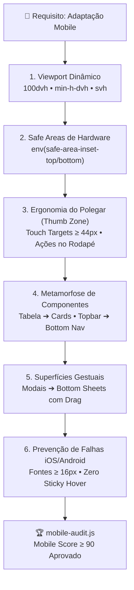
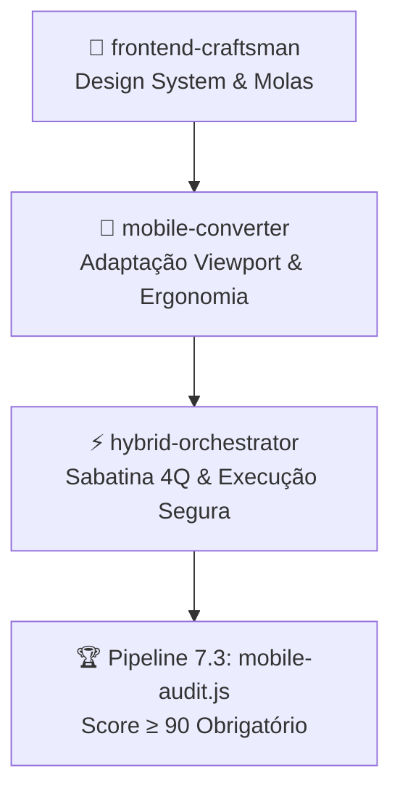

# 📱 mobile-converter: Engenharia de Adaptação Mobile de Alta Fidelidade

Esta skill transforma telas, páginas ou componentes pensados para desktop em **experiências mobile nativas de primeiro escalão** (nível iOS/Android nativo, Airbnb, Linear e Nubank), eliminando o "Mobile Slop" (interfaces quebradas em celulares, tabelas que estouram a tela, botões minúsculos e menus inacessíveis).

---

## 🛑 Quando Ativar Esta Skill
Ative o protocolo sempre que:
1. O usuário pedir para **adaptar, converter ou ajustar** um site, página ou tela existente para mobile/responsivo.
2. For criar uma nova tela com foco explícito em **Mobile-First**.
3. Uma interface apresentar **scroll horizontal indesejado**, quebras de layout ou elementos sobrepostos em telas pequenas (< 430px).
4. For necessário converter tabelas complexas em cards ou listas verticais táteis.
5. Antes de aprovar pull requests ou entregas de front-end para garantir o **Mobile Readiness Score ≥ 90/100**.

---

## 📱 Os 7 Pilares de Conversão Mobile (Anti-Mobile Slop)



---

## 📐 1. Viewport Dinâmico: Eliminação do Bug do `100vh`
**NUNCA use `h-screen` ou `100vh` em contêineres principais no mobile.** No iOS Safari e Chrome Android, as barras de navegação do browser cobrem o rodapé da tela.
- **Correto:** Use `100dvh` (Dynamic Viewport Height) ou `min-h-dvh` com fallback:
```css
/* CSS Puro */
min-height: 100vh;
min-height: 100dvh;
```
```tsx
// Tailwind CSS
<div className="min-h-screen min-h-dvh flex flex-col">
```

---

## 🛡️ 2. Safe Areas de Hardware (Notch & Home Bar)
Dispositivos modernos possuem ilha dinâmica/notch e barra de navegação gestual na base. Barras fixas sem padding de safe-area ficam cobertas pela linha home do iPhone.
- Adicione suporte obrigatório às safe-areas:
```css
/* CSS Puro */
padding-bottom: max(16px, env(safe-area-inset-bottom));
padding-top: max(12px, env(safe-area-inset-top));
```
```tsx
// Tailwind com classe utilitária
<nav className="fixed bottom-0 inset-x-0 pb-[env(safe-area-inset-bottom)] bg-neutral-900/90 backdrop-blur-md">
```

---

## 👆 3. Ergonomia do Polegar (Thumb Zone) & Touch Targets
No celular, o usuário navega com uma das mãos.
1. **Touch Targets de no mínimo 44×44px:** Todo botão, ícone clicável ou tab deve respeitar o padrão Apple HIG / Google Material:
   - Use `min-h-[44px] min-w-[44px]` ou aumente o padding interno (`p-3`).
2. **Ações Primárias na Base:** Ações cruciais ("Comprar", "Salvar", "Continuar") devem ficar fixadas na base (`fixed bottom-0` ou sticky no rodapé), dentro da zona confortável do polegar.
3. **`touch-action: manipulation`:** Elimina o delay de 300ms de clique duplo no mobile.

---

## 🔄 4. As 4 Grandes Metamorfoses de Paradigma

### a) Metamorfose 1: Tabela Desktop ➔ Feed de Cards Táteis
Tabelas largas com 5+ colunas estragam a experiência mobile. 
- **Estratégia Obrigatória:** No desktop renderize a tabela clássica (`hidden md:table`). No mobile, renderize uma pilha vertical de cards táteis (`md:hidden flex flex-col gap-3`) com labels claros e ações rápidas.
- Use o template oficial [templates/ResponsiveTableToCards.tsx](file:///c:/Users/chalves/Documents/Projetos/skill%27s/mobile-converter/templates/ResponsiveTableToCards.tsx).

### b) Metamorfose 2: Topbar / Sidebar Desktop ➔ Bottom Nav Bar
Sidebars ocupam espaço horizontal precioso e cabeçalhos superiores exigem esticar o polegar.
- No mobile, oculte menus laterais extensos e coloque as 4–5 abas principais em uma **Bottom Navigation Bar** estilo iOS.
- Use o template oficial [templates/MobileBottomNav.tsx](file:///c:/Users/chalves/Documents/Projetos/skill%27s/mobile-converter/templates/MobileBottomNav.tsx).

### c) Metamorfose 3: Modais Centrados ➔ Swipeable Bottom Sheet
Modais centralizados no meio da tela no celular parecem desktop mal dimensionado e impedem a rolagem do fundo.
- Converta modais mobile em **Bottom Sheets** com puxador superior (pill handle), fundo translúcido e gesto de arrastar para baixo para fechar (`drag="y"` do Framer Motion).
- Use o template oficial [templates/BottomSheet.tsx](file:///c:/Users/chalves/Documents/Projetos/skill%27s/mobile-converter/templates/BottomSheet.tsx).

### d) Metamorfose 4: Desktop Hover ➔ Touch Feedback
No mobile, `:hover` causa o vício do **"sticky hover"** (o botão fica com a cor de foco mesmo após soltar o dedo).
- Use `whileTap={{ scale: 0.96 }}` do Framer Motion ou classes `:active:scale-95` no lugar de efeitos puramente baseados em hover.

### e) Metamorfose 5: Ações em Lista ➔ Swipeable Rows (Gesto Lateral)
Em listas de dados móveis, expor múltiplos botões consome espaço vertical.
- Adicione ações reveladas por arrasto horizontal para a esquerda (ex: Arquivar e Excluir estilo iOS/WhatsApp).
- Use o template oficial [templates/SwipeableRow.tsx](file:///c:/Users/chalves/Documents/Projetos/skill%27s/mobile-converter/templates/SwipeableRow.tsx).

---

## 🚫 5. A Armadilha do Auto-Zoom no iOS Safari
Se qualquer `<input>`, `<select>` ou `<textarea>` tiver tamanho de fonte **menor que 16px**, o iOS Safari aplica zoom automático na tela ao receber foco, quebrando o layout da aplicação.
- **Regra Estrita:** Em telas mobile, inputs devem ter `font-size: 16px` (`text-base`).
- Use Tailwind responsivo: `text-base md:text-sm` (16px no mobile, 14px no desktop).

---

## 📱 6. Simulador Visual de Telas no Navegador (`preview-mobile.js`)

A skill inclui um simulador local instantâneo que abre no navegador uma **moldura realista de iPhone 15 Pro / Galaxy**, permitindo alternar tamanhos de tela e testar os gestos interativamente antes de aprovar código:

```bash
# Abrir simulador no navegador em 1 segundo:
node mobile-converter/scripts/preview-mobile.js

# Simular em dispositivo específico:
node mobile-converter/scripts/preview-mobile.js --device=iphone15
node mobile-converter/scripts/preview-mobile.js --device=iphonese
node mobile-converter/scripts/preview-mobile.js --device=galaxy
```

---

## 🛠️ Motor Determinístico de Auditoria: `mobile-audit.js`

A skill conta com um script de análise estática determinística que audita a base de código e gera o **Mobile Readiness Score (0 a 100)**:

```bash
# Auditar um arquivo específico:
node mobile-converter/scripts/mobile-audit.js src/pages/Checkout.tsx

# Auditar uma pasta inteira:
node mobile-converter/scripts/mobile-audit.js src/components/

# Aplicar correções automáticas (Autofix):
node mobile-converter/scripts/mobile-audit.js src/ --fix
```

### O que o auditor analisa:
1. `viewport-fit=cover` na meta tag HTML (essencial para ativar `env(safe-area-inset-*)` no iOS Safari);
2. `h-screen` / `100vh` sem tratamento de `100dvh`;
3. Elementos fixos no rodapé (`bottom-0`) sem padding de safe area;
4. Inputs com `text-xs` ou `text-sm` sem proteção de 16px (`text-base`);
5. Tags `<table>` sem contêiner de overflow ou fallback mobile;
6. Botões e links com padding inferior a 40px de área de toque;
7. Classes de largura fixa (`w-[600px]`, `min-w-[500px]`) que quebram o viewport de 390px.

---

## 🤝 O Elo com o Ecossistema de Skills



1. **Com `frontend-craftsman`:** O Craftsman gera a paleta, tipografia e física de molas. O Mobile Converter garante que os componentes usem Bottom Sheets, safe areas e touch targets corretos.
2. **Com `hybrid-orchestrator`:** Quando uma tarefa envolve responsividade ou mobile, o Orchestrator aciona o `mobile-converter` para garantir que o código passe no pipeline `mobile-audit.js (Score ≥ 90)`.
