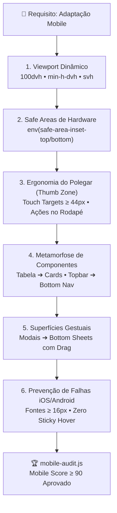

# 📱 mobile-converter: Engenharia de Adaptação Mobile de Alta Fidelidade

Esta skill transforma telas, páginas ou componentes pensados para desktop em **experiências mobile nativas de primeiro escalão** (nível iOS/Android nativo, Airbnb, Linear e Nubank), eliminando o "Mobile Slop" (interfaces quebradas em celulares, tabelas que estouram a tela, botões minúsculos e menus inacessíveis).

---

## 🛑 Quando Ativar Esta Skill
Ative o protocolo sempre que:
1. O usuário pedir para **adaptar, converter ou ajustar** um site, página ou tela existente para mobile/responsivo.
2. For criar uma nova tela com foco explícito em **Mobile-First**.
3. Uma interface apresentar **scroll horizontal indesejado**, quebras de layout ou elementos sobrepostos em telas pequenas (< 430px).
4. For necessário converter tabelas complexas em cards ou listas verticais táteis.
5. Antes de aprovar pull requests ou entregas de front-end para garantir o **Mobile Readiness Score ≥ 90/100**.

---

## 📱 Os 7 Pilares de Conversão Mobile (Anti-Mobile Slop)



---

## 📐 1. Viewport Dinâmico: Eliminação do Bug do `100vh`
**NUNCA use `h-screen` ou `100vh` em contêineres principais no mobile.** No iOS Safari e Chrome Android, as barras de navegação do browser cobrem o rodapé da tela.
- **Correto:** Use `100dvh` (Dynamic Viewport Height) ou `min-h-dvh` com fallback:
```css
/* CSS Puro */
min-height: 100vh;
min-height: 100dvh;
```
```tsx
// Tailwind CSS
<div className="min-h-screen min-h-dvh flex flex-col">
```

---

## 🛡️ 2. Safe Areas de Hardware (Notch & Home Bar)
Dispositivos modernos possuem ilha dinâmica/notch e barra de navegação gestual na base. Barras fixas sem padding de safe-area ficam cobertas pela linha home do iPhone.
- Adicione suporte obrigatório às safe-areas:
```css
/* CSS Puro */
padding-bottom: max(16px, env(safe-area-inset-bottom));
padding-top: max(12px, env(safe-area-inset-top));
```
```tsx
// Tailwind com classe utilitária
<nav className="fixed bottom-0 inset-x-0 pb-[env(safe-area-inset-bottom)] bg-neutral-900/90 backdrop-blur-md">
```

---

## 👆 3. Ergonomia do Polegar (Thumb Zone) & Touch Targets
No celular, o usuário navega com uma das mãos.
1. **Touch Targets de no mínimo 44×44px:** Todo botão, ícone clicável ou tab deve respeitar o padrão Apple HIG / Google Material:
   - Use `min-h-[44px] min-w-[44px]` ou aumente o padding interno (`p-3`).
2. **Ações Primárias na Base:** Ações cruciais ("Comprar", "Salvar", "Continuar") devem ficar fixadas na base (`fixed bottom-0` ou sticky no rodapé), dentro da zona confortável do polegar.
3. **`touch-action: manipulation`:** Elimina o delay de 300ms de clique duplo no mobile.

---

## 🔄 4. As 4 Grandes Metamorfoses de Paradigma

### a) Metamorfose 1: Tabela Desktop ➔ Feed de Cards Táteis
Tabelas largas com 5+ colunas estragam a experiência mobile. 
- **Estratégia Obrigatória:** No desktop renderize a tabela clássica (`hidden md:table`). No mobile, renderize uma pilha vertical de cards táteis (`md:hidden flex flex-col gap-3`) com labels claros e ações rápidas.
- Use o template oficial [templates/ResponsiveTableToCards.tsx](file:///c:/Users/chalves/Documents/Projetos/skill%27s/mobile-converter/templates/ResponsiveTableToCards.tsx).

### b) Metamorfose 2: Topbar / Sidebar Desktop ➔ Bottom Nav Bar
Sidebars ocupam espaço horizontal precioso e cabeçalhos superiores exigem esticar o polegar.
- No mobile, oculte menus laterais extensos e coloque as 4–5 abas principais em uma **Bottom Navigation Bar** estilo iOS.
- Use o template oficial [templates/MobileBottomNav.tsx](file:///c:/Users/chalves/Documents/Projetos/skill%27s/mobile-converter/templates/MobileBottomNav.tsx).

### c) Metamorfose 3: Modais Centrados ➔ Swipeable Bottom Sheet
Modais centralizados no meio da tela no celular parecem desktop mal dimensionado e impedem a rolagem do fundo.
- Converta modais mobile em **Bottom Sheets** com puxador superior (pill handle), fundo translúcido e gesto de arrastar para baixo para fechar (`drag="y"` do Framer Motion).
- Use o template oficial [templates/BottomSheet.tsx](file:///c:/Users/chalves/Documents/Projetos/skill%27s/mobile-converter/templates/BottomSheet.tsx).

### d) Metamorfose 4: Desktop Hover ➔ Touch Feedback
No mobile, `:hover` causa o vício do **"sticky hover"** (o botão fica com a cor de foco mesmo após soltar o dedo).
- Use `whileTap={{ scale: 0.96 }}` do Framer Motion ou classes `:active:scale-95` no lugar de efeitos puramente baseados em hover.

### e) Metamorfose 5: Ações em Lista ➔ Swipeable Rows (Gesto Lateral)
Em listas de dados móveis, expor múltiplos botões consome espaço vertical.
- Adicione ações reveladas por arrasto horizontal para a esquerda (ex: Arquivar e Excluir estilo iOS/WhatsApp).
- Use o template oficial [templates/SwipeableRow.tsx](file:///c:/Users/chalves/Documents/Projetos/skill%27s/mobile-converter/templates/SwipeableRow.tsx).

### f) Metamorfose 6: Multi-Colunas (Chat/Inboxes) ➔ Fluxo Master-Detail
NUNCA empilhe colunas de chat/atendimento verticalmente no celular (`flex-direction: column` cego).
- **Estratégia Obrigatória:** No mobile, exiba apenas a lista de conversas quando nenhum chat estiver selecionado. Ao clicar em uma conversa, oculte a lista e exiba a área de chat em tela cheia com botão tátil de retorno (`← Voltar`) chamando `onCloseChat()` ou limpando o `selectedId`.
- **Eliminação de Cards Vazios:** Oculte placeholders de tela vazia secundários no mobile (`display: none`).

### g) Clearance de Elementos Fixos (Menu Hambúrguer / Toggles)
Botões fixos no topo/esquerda (ex: `top: 16px; left: 16px`) NUNCA podem colidir ou sobrepor o título da página.
- **Estratégia Obrigatória:** Adicione `padding-left: 52px+` no cabeçalho ou reduza proporcionalmente a tipografia do título (`font-size: 1.15rem`) no breakpoint mobile para acomodar o botão de menu lado a lado.

---

## 🚫 5. A Armadilha do Auto-Zoom no iOS Safari
Se qualquer `<input>`, `<select>` ou `<textarea>` tiver tamanho de fonte **menor que 16px**, o iOS Safari aplica zoom automático na tela ao receber foco, quebrando o layout da aplicação.
- **Regra Estrita:** Em telas mobile, inputs devem ter `font-size: 16px` (`text-base`).
- Use Tailwind responsivo: `text-base md:text-sm` (16px no mobile, 14px no desktop).

---

## 📱 6. Simulador Visual de Telas no Navegador (`preview-mobile.js`)

A skill inclui um simulador local instantâneo que abre no navegador uma **moldura realista de iPhone 15 Pro / Galaxy**, permitindo alternar tamanhos de tela e testar os gestos interativamente antes de aprovar código:

```bash
# Abrir simulador no navegador em 1 segundo:
node mobile-converter/scripts/preview-mobile.js

# Simular em dispositivo específico:
node mobile-converter/scripts/preview-mobile.js --device=iphone15
node mobile-converter/scripts/preview-mobile.js --device=iphonese
node mobile-converter/scripts/preview-mobile.js --device=galaxy
```

---

## 🛠️ Ferramentas da Skill

### 1. Auditoria Estática Mobile por Blocos (`mobile-audit.js v3.0.0`)
Script determinístico baseado em parser de blocos CSS (Scoped CSS, Styled-Components, Media Queries e Tailwind). Audita e gera o **Mobile Readiness Score (0 a 100)**:

```bash
# Auditar arquivo ou pasta inteira:
node mobile-converter/scripts/mobile-audit.js src/ --json
```

#### Regras Bloqueantes e Alertas Verificados:
1. **`STACKED_COLUMNS` (Erro):** Layouts multi-coluna desktop que viram uma pilha vertical gigante no mobile sem fluxo Master-Detail.
2. **`GRID_FIXED_OVERFLOW` (Erro):** Grids com colunas de largura fixa em pixels (`280px 280px`) que somam mais de 390px e quebram a viewport.
3. **`SAFE_AREA_BOTTOM` (Erro):** Barras fixas na base sem `env(safe-area-inset-bottom)`, ficando sob o indicador Home do iPhone.
4. **`VIEWPORT_100VH` (Erro):** `100vh` ou `h-screen` sem `100dvh`, cortando conteúdo atrás das barras do navegador mobile.
5. **`IOS_INPUT_ZOOM` (Erro):** Campos de formulário com fonte `< 16px` (`text-sm`, `14px`), provocando zoom involuntário no iOS Safari.
6. **`FIXED_NAV_COLLISION` (Alerta):** Botão fixo no topo (ex.: hambúrguer em `top: 16px; left: 16px`) sem padding de afastamento (`padding-left: 64px`) no cabeçalho.
7. **`SMALL_TOUCH_TARGET` (Alerta):** Botões e controles com área menor que 44×44px (Apple HIG / WCAG 2.5.5).
8. **`FIXED_WIDTH_SPILL` (Erro):** Elementos com `width` fixo maior que a tela do celular (~390px).

### 2. Verificação Visual Headless (`visual-check.js v1.0.0`)
Executa o Playwright em modo headless para auditar a interface renderizada real no viewport móvel (390×844px):
- Mede se há colisão física real entre botões flutuantes e títulos via `document.elementFromPoint`.
- Detecta estouro horizontal de viewport (`document.body.scrollWidth > window.innerWidth`).
- Mede a área física real clicável (bounding rect) de todos os botões no celular.
```bash
# Auditar preview ou HTML compilado:
node mobile-converter/scripts/visual-check.js .craft/preview.html

# Auditar aplicação em execução local:
node mobile-converter/scripts/visual-check.js http://localhost:3000 --json
```

### 3. Simulador Visual de Telas no Navegador (`preview-mobile.js`)
Abre uma moldura realista no browser para testar interativamente em múltiplos dispositivos:
```bash
node mobile-converter/scripts/preview-mobile.js --device=iphone15
```

---

## 🔄 Fluxo de Resolução Autônoma & Master-Detail

O agente opera sem esperar comandos avulsos (`/mobile`):
1. **Em telas de Atendimento / Chat / Inboxes:**
   - Implemente obrigatoriamente o padrão **Master-Detail**: no celular, exiba a lista de itens quando nada estiver selecionado; ao selecionar, esconda a lista e exiba a conversa em tela cheia com botão de retorno `← Voltar` (≥44px) e altura `100dvh`.
   - Garanta `padding-left: 64px` ou recuo adequado no cabeçalho se houver botão fixo de menu lateral.
2. **Execução Pós-Edição:**
   - Execute `node mobile-converter/scripts/mobile-audit.js <caminho>` para garantir Score ≥ 85.
   - Execute `node mobile-converter/scripts/visual-check.js` para certificar que nenhum elemento colide fisicamente.
