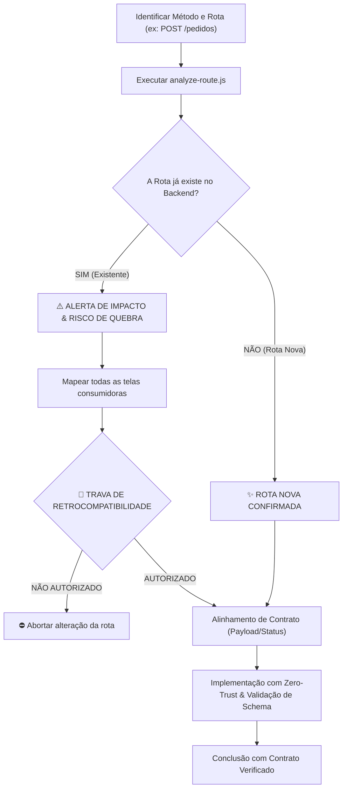

# 🛡️ Route Guard — Protocolo de Análise de Rotas, Impacto e Zero-Trust

Esta skill define o protocolo padronizado para **criação, alteração e governança de rotas/endpoints** em qualquer aplicação web e API, garantindo que modificações em contratos não quebrem telas dependentes, que o desenvolvedor confirme alterações em rotas existentes e que novas rotas sigam a política Zero-Trust.

---

## 🎯 Quando Acionar Esta Skill

Ative e siga este protocolo sempre que:
1. For criar uma **nova rota ou endpoint** na API ou no Backend.
2. For **alterar** um endpoint existente, seu método HTTP, payload de requisição (Body/Query) ou formato de resposta (JSON).
3. For editar contratos de comunicação entre o Front-end e o Back-end.
4. For alterar regras de permissão (RBAC), middlewares de autenticação ou filtros de tenant.
5. Antes de aprovar pull requests envolvendo comunicação HTTP.

---

## 🔄 Fluxo de Decisão



---

## 🛠️ Passo a Passo Operacional

### Passo 1: Análise Automatizada de Rota
Antes de tocar em qualquer arquivo, rode o analisador:
```bash
node scripts/analyze-route.js <MÉTODO> <ENDPOINT>
```
*Exemplos:*
- `node scripts/analyze-route.js POST /api/v1/orders`
- `node scripts/analyze-route.js GET /users/:id`

---

### Passo 2: Avaliação de Cenário & Trava de Permissão

#### 🔴 Cenário A: A Rota JÁ EXISTE (Alerta de Quebra de Contrato)
1. **Identificar Consumidores:** O script lista onde a rota está declarada e todas as telas/arquivos que a chamam.
2. **Trava de Permissão Obrigatória:**
   - O assistente **NÃO edita o código** da rota antes da resposta do usuário.
   - Apresenta:
     > *"⚠️ **ATENÇÃO:** A rota `[MÉTODO] /endpoint` já existe e alimenta X arquivos (Risco [ALTO/MÉDIO]). Você confirma que deseja alterá-la e assume a responsabilidade de ajustar os consumidores listados? (Sim / Não)"*

#### 🟢 Cenário B: A Rota NÃO EXISTE (Rota Nova)
- Confirma que o endpoint é novo e não conflita com rotas existentes.

---

### Passo 3: Alinhamento de Contrato & Zero-Trust
Para rotas novas e existentes, alinhe formalmente:
1. **Payload de Entrada:** Parâmetros obrigatórios no `body`, `query` ou `params` e validação estrita de schema (Zod, Yup, Joi ou DTO tipado).
2. **Payload de Saída:** Estrutura exata do JSON que o cliente espera receber e status HTTP apropriados (`200`, `201`, `400`, `401`, `403`, `404`).
3. **Controle de Acesso (RBAC):** Rota pública ou protegida? Exige autenticação? Quem tem permissão de chamada (roles)?
4. **Isolamento de Recurso (Anti-IDOR):** Garantir que o usuário autenticado só consiga manipular os dados que pertencem a ele ou ao seu tenant.

---

### Passo 4: Implementação com Blindagem Zero-Trust
Toda rota deve obrigatoriamente cumprir:
- Middleware de autenticação ativo em rotas privadas.
- Validação de entrada na porta de entrada da requisição antes de tocar no banco.
- Tratamento assíncrono com `try/catch` para prevenir crash do servidor.
- Headers e cookies seguros (`HttpOnly`, `SameSite`, `Secure`).

---

## 🤝 Integração com o `hybrid-orchestrator`
O `route-guard` fornece a análise cirúrgica de contratos HTTP que alimenta o **Q1 (Contratos de API & Tipagem)** e a **Seção 3.1 (Análise de Impacto)** do `hybrid-orchestrator`.
